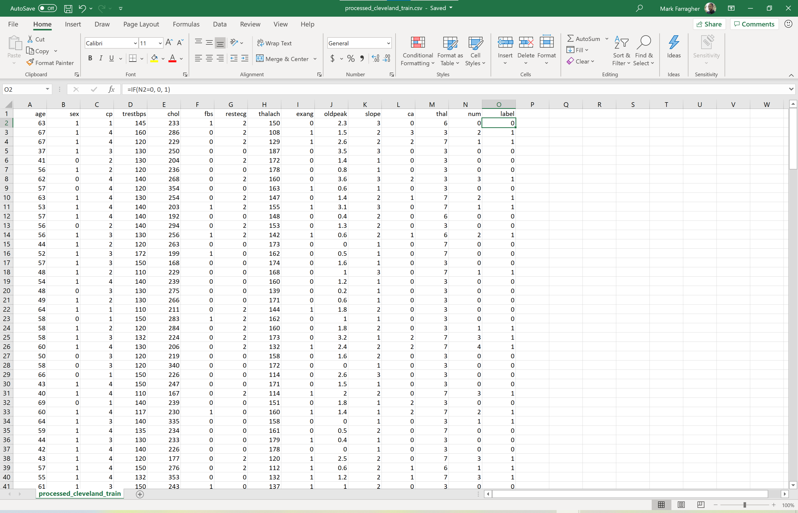
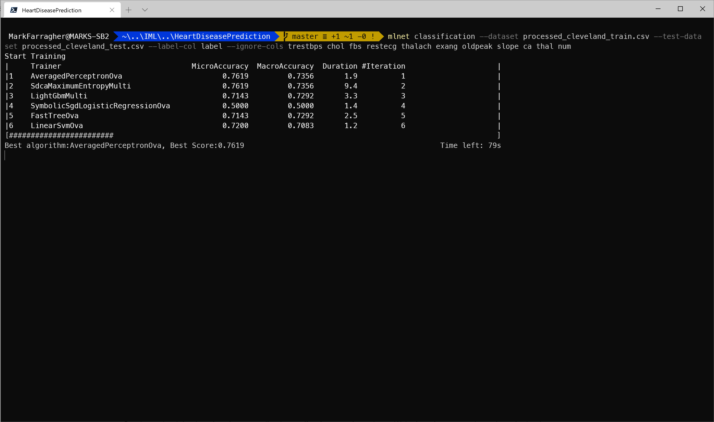
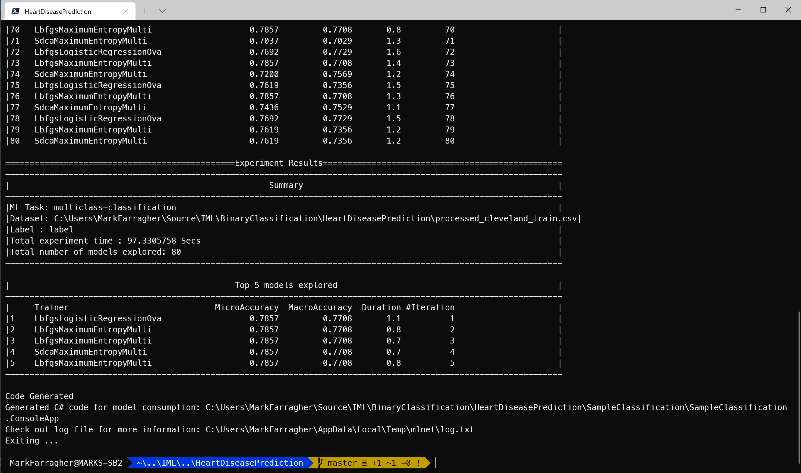
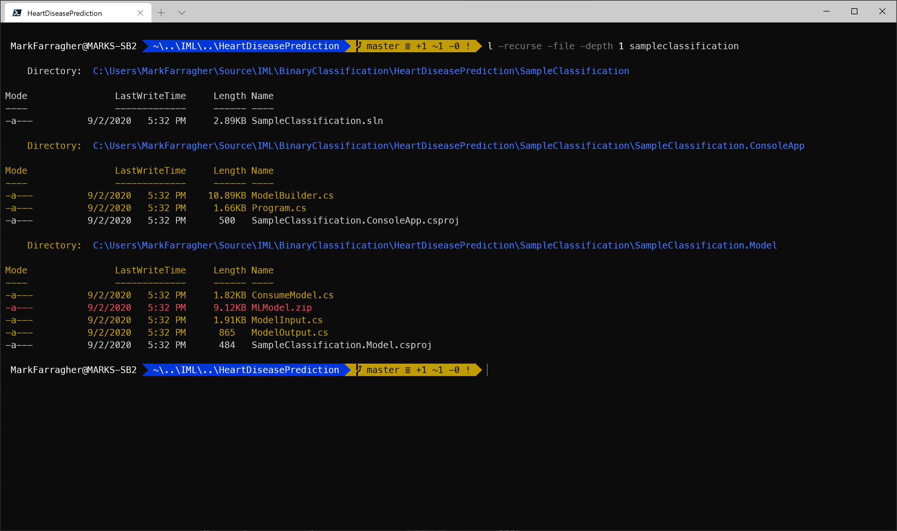
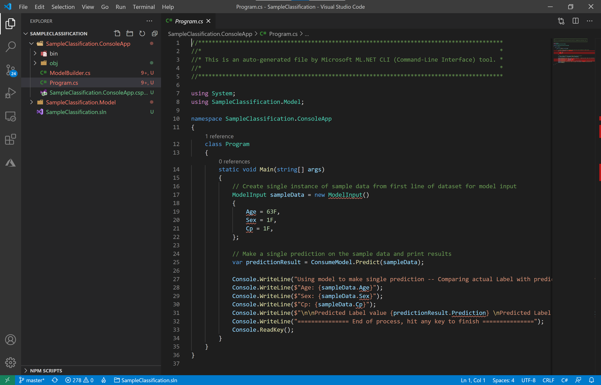
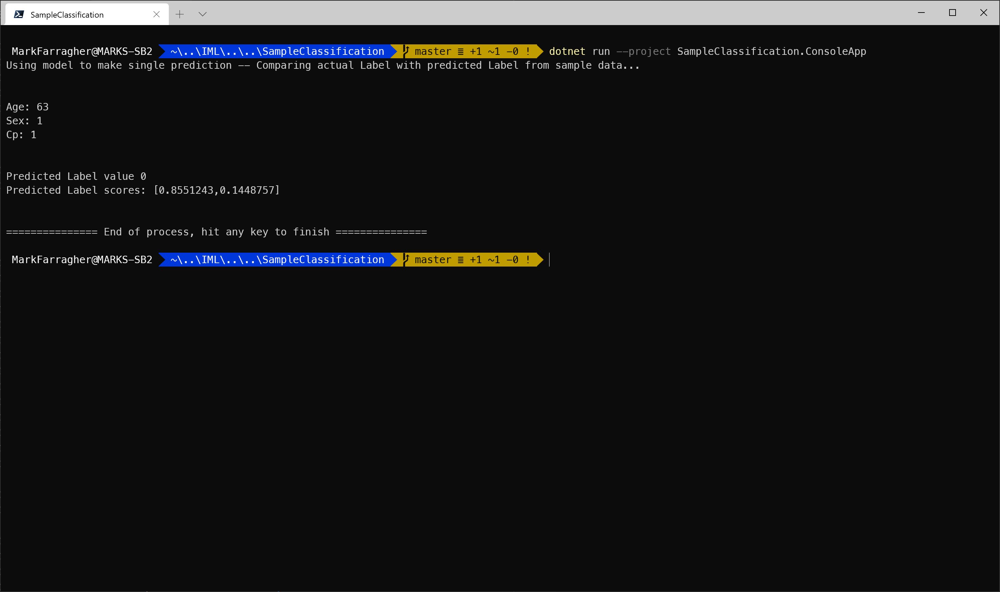
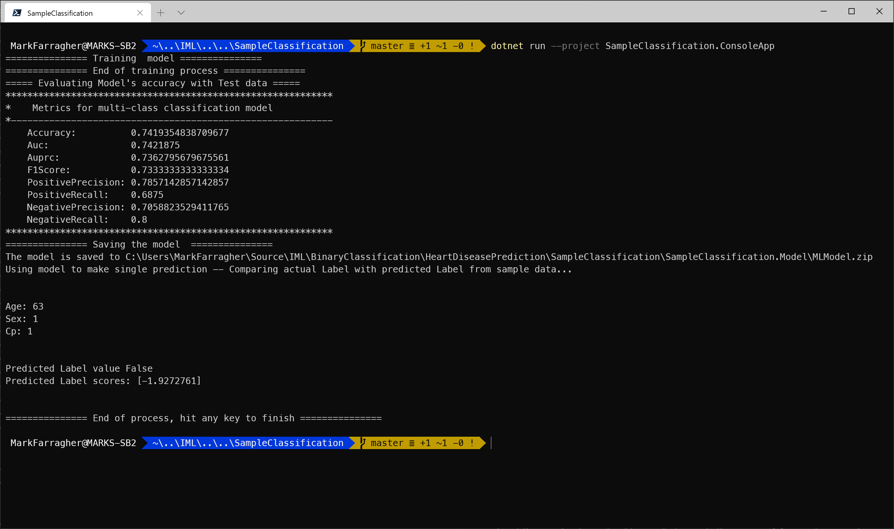

# Assignment: Predict heart disease in Cleveland

Coronary artery disease (CAD) involves the reduction of blood flow to the heart muscle due to build-up of plaque in the arteries of the heart. It is the most common form of cardiovascular disease, and the only reliable way to detect it right now is through a costly and invasive procedure called coronary angiography. This procedure represents the gold standard for detecting CAD, but unfortunately comes with increased risk to CAD patients. 

So it would be really nice if we had some kind of realiable and non-invasive alternative to replace the current gold standard.

Other less invasive diagnostic tools do exist. Doctors have proposed using electrocardiograms, thallium scintigraphy and fluoroscopy of coronary calcification. However the diagnostic accuracy of these tests only ranges between 35%-75%. 

However, we can try to build a machine learning model that trains on the results of these non-invasive tests and combines them with other patient attributes to generate a CAD diagnosis. If the model predictions are accurate enough, we can use the model to replace the current invasive procedure and save patient lives.

To train our model, we're going to use the the Cleveland CAD dataset from the University of California UCI. The data contains real-life diagnostic information of 303 anonymized patients and was compiled by Robert Detrano, M.D., Ph.D of the Cleveland Clinic Foundation back in 1988. 

The dataset contains 13 features which include the results of the aforementioned non-invasive diagnostic tests along with other relevant patient information. The label represents the result of the invasive coronary angiogram and indicates the presence or absence of CAD in the patient. A label value of 0 indicates absence of CAD and label values 1-4 indicate the presence of CAD. 

Do you think you can develop a medical-grade diagnostic tool for heart disease? 

Let's find out!

## Get the dataset

Let's start by downloading the dataset. Grab the [Cleveland Heart Disease Training](#) and [Cleveland Heart Disease Testing](#) datasets and save them as **processed_cleveland_train.csv** and **processed_cleveland_test.csv** respectively. 

The data files look like this:



They are CSV files with 15 columns of information:

* Age
* Sex: 1 = male, 0 = female
* Chest Pain Type: 1 = typical angina, 2 = atypical angina , 3 = non-anginal pain, 4 = asymptomatic
* Resting blood pressure in mm Hg on admission to the hospital
* Serum cholesterol in mg/dl
* Fasting blood sugar > 120 mg/dl: 1 = true; 0 = false
* Resting EKG results: 0 = normal, 1 = having ST-T wave abnormality, 2 = showing probable or definite left ventricular hypertrophy by Estes’ criteria
* Maximum heart rate achieved
* Exercise induced angina: 1 = yes; 0 = no
* ST depression induced by exercise relative to rest
* Slope of the peak exercise ST segment: 1 = up-sloping, 2 = flat, 3 = down-sloping
* Number of major vessels (0–3) colored by fluoroscopy
* Thallium heart scan results: 3 = normal, 6 = fixed defect, 7 = reversible defect
* Diagnostic code: 0 = normal risk, 1-4 = elevated risk
* Label: 0 = normal risk, 1 = elevated risk

The first 13 columns are patient diagnostic information and column 14 is the diagnosis code: 0 means a healthy patient, and values 1-4 mean an elevated risk of heart disease.

To make it easy to train on this dataset, I added a column 15 with a boolean diagnosis: 0 means a healthy patient, and 1 means an elevated risk of heart disease.

You are now going to build a binary classification machine learning model that reads in all 13 columns of patient information, and then makes a prediction for the heart disease risk.

To start, please open a console window. You are going to create a folder to hold the files of this assignment:

```bash
mkdir HeartDiseasePrediction
cd HeartDiseasePrediction
```

Also make sure to copy the dataset files into this folder. 

## Train the model

Now you're ready to start training a machine learning model. To keep things simple we're only going to look at the **sex**, **age** and **cp** columns for now and ignore everything else in the dataset. 

Type the following command in your console window:

```bash
mlnet classification --dataset processed_cleveland_train.csv --test-dataset processed_cleveland_test.csv --label-col label --ignore-cols trestbps chol fbs restecg thalach exang oldpeak slope ca thal num
```

Note that the --test-dataset parameter is back, because this dataset comes in separate training and testing files. 

Here's what the running app looks like in Windows Terminal:



The tool has loaded the training dataset and is now randomly trying out machine learning algorithms and algorithm parameters to create the best possible fare predictions.

You can see that at the point of the screenshot, the tool has already tried out 6 different machine learning algorithms, these are listed in the **Training** column. 

The performance of each algorithm is listed in the **MicroAccuracy** and **MacroAccuracy** columns. The tool uses the MicroAccuracy value to keep track of the best algorithm to date, which is shown in the final line of text. 

In the screenshot, the best algorithm is AveragedPerceptronOva which achieved a MicroAccuracy of 0.7619 (bigger is better). This happened in experiment 1. 

The tool continues to try out algorithms until a set time period has expired. The default period is 600 seconds, at which the tool selects the winning algorithm.

Here's what that looks like:



After 80 experiments, the tool has selected LbfgsLogisticRegressionOva as the winning algorithm. It achieved a winning MicroAccuracy value of 0.7857.

You may be wondering what the micro- and macro accuracies actually are. We haven't covered them in the precedig course lectures yet, so where is this coming from?

Micro- and macro accuracy are actually **multiclass** classification metrics. They can be used to evaluate classifiers that can produce more than 2 possible output values. We will learn all about multiclass classification in the next section.

We have uncovered a bug: the ML.NET CLI tool cannot handle binary classification and treats everything as a multiclass classification problem.

This is unfortunate, but we can fix it in a couple of minutes when we review the C# source code. 

The tool has created a C# app for us and placed the project files in the **SampleClassification** folder.

## Inspect the C# code

Let's check the files agail that the CLI tool has created. Run the following Powershell command on the console:

```bash
l -recurse -file -depth 1 sampleclassification
```

You'll see the following output:



There are three folders:

* **SampleClassification**: The solution folder for the generated app containing a single SLN file for Visual Studio.
* **SampleClassification/SampleClassification.ConsoleApp**: A console project that consumes the fully-trained model to make a prediction. There's also a **ModelBuilder.cs** file which can train the model from scratch.
* **SampleClassification/SampleClassification.Model**: A library project with helper classes for training and consuming the model. There's also a ZIP file with a saved copy of the fully-trained model which can be consumed right away without any further training. 

This is the same folder structure as we saw in the regression experiments, but now the project is called 'SampleClassification' instead.

So again, you have two possible scenarios for building your own heart disease prediction app:

* Load the ZIP file with the fully-trained model and start making predictions right away. You'll need to link the **SampleClassification.Model** project into your own solution, and then use the code in **SampleClassification.ConsoleApp/Program.cs** as a starting point to consume the model. 
* Train your own model from scratch. You'll need to link the **SampleClassification.Model** project into your own solution, and then use the code in **SampleClassification.ConsoleApp/ModelBuilder.cs** as a starting point to train your model. You'll also need to put the CSV training file in your project directory. 

### The SampleClassification.ConsoleApp project

We've already inspected the generated code twice when we covered regression. So let's do a quick scan to see how the act of classification has changed the generated code.

Go to the SampleRegression folder and open Visual Studio code:

```bash
cd SampleClassification
code .
```

In Visual Studio Code, select the **SampleClassification.ConsoleApp/Program.cs** file. You'll see something like this:



The code sets up a new 63 year old male patient with typical angina pain, and runs a prediction. 

But check out the code at the bottom that displays the prediction:

```csharp
Console.WriteLine("Using model to make single prediction -- Comparing actual Label with predicted Label from sample data...\n\n");
Console.WriteLine($"Age: {sampleData.Age}");
Console.WriteLine($"Sex: {sampleData.Sex}");
Console.WriteLine($"Cp: {sampleData.Cp}");
Console.WriteLine($"\n\nPredicted Label value {predictionResult.Prediction} \nPredicted Label scores: [{String.Join(",", predictionResult.Score)}]\n\n");
Console.WriteLine("=============== End of process, hit any key to finish ===============");
```

See the **predictionResult.Score**? 

This classification model returns the probabilities for every possible class output. So we get individual predictions for if the patient is healthy or if they have heart disease. 

The model also uses an internal threshold value to convert these probabilities to an explicit prediction. We can access this prediction through the **predictionResult.Prediction** property. This is a number, with 0 meaning a healthy patient and 1 meaning a patient with elevated risk of heart disease.

Despite being a number, the property is defined as a **string**. This may seem weird, but we'll get to that in a minute.

Let's run this app to make sure everything works. 

Type the following on the console:

```bash
dotnet run --project SampleClassification.ConsoleApp
```

This will run the app and show the following:



Given a 63 year old male patient with typical angina pain, the model predicts that this patient is healthy. The probability of the patient being healthy is 85.51% and there's a 14.49% chance of an elevated risk of heart disease.

That's interesting, don't you think? Despite the patient reporting typical angina pain which is a very common symptom of heart disease, the model is quite confident that this patient is healthy. 

The model has learned this from all the patients in the dataset that complain about angina and where a subsequent coronary angiography found nothing. These patients underwent a needless procedure, and this model could have protected them from the extra risk. 

### The SampleClassification.Model project

Now let's take a peek at the **ModelInput** class. 

Select the **SampleClassification.Model/ModelInput.cs** file in Visual Studio Code. You'll see that it looks like this:

```csharp
    public class ModelInput
    {
        [ColumnName("age"), LoadColumn(0)]
        public float Age { get; set; }

        [ColumnName("sex"), LoadColumn(1)]
        public float Sex { get; set; }

        [ColumnName("cp"), LoadColumn(2)]
        public float Cp { get; set; }

        [ColumnName("trestbps"), LoadColumn(3)]
        public float Trestbps { get; set; }

        [ColumnName("chol"), LoadColumn(4)]
        public float Chol { get; set; }

        [ColumnName("fbs"), LoadColumn(5)]
        public float Fbs { get; set; }

        [ColumnName("restecg"), LoadColumn(6)]
        public float Restecg { get; set; }

        [ColumnName("thalach"), LoadColumn(7)]
        public float Thalach { get; set; }

        [ColumnName("exang"), LoadColumn(8)]
        public float Exang { get; set; }

        [ColumnName("oldpeak"), LoadColumn(9)]
        public float Oldpeak { get; set; }

        [ColumnName("slope"), LoadColumn(10)]
        public float Slope { get; set; }

        [ColumnName("ca"), LoadColumn(11)]
        public float Ca { get; set; }

        [ColumnName("thal"), LoadColumn(12)]
        public float Thal { get; set; }

        [ColumnName("num"), LoadColumn(13)]
        public float Num { get; set; }

        [ColumnName("label"), LoadColumn(14)]
        public string Label { get; set; }
    }
```

Pretty much what we expected. But look at the last **Label** field: it's a string, not a float.

Multiclass classification can predict any kind of output value. In this dataset, we're using 0 for healthy patients and 1 for sick patients. But the model treats this as an enumeration by loading the numbers as strings. This guarantees that the model will not ascribe any meaning to the numerical value of the categories.

We could just as wel use strings in the dataset, with 'healthy' denoting healthy patients and 'sick' denoting sick patients. It would make no difference to the app. 

Let's continue our code inspection. 

Here's what the **ModelOutput.cs** file looks like:

```csharp
public class ModelOutput
{
    // ColumnName attribute is used to change the column name from
    // its default value, which is the name of the field.
    [ColumnName("PredictedLabel")]
    public String Prediction { get; set; }
    public float[] Score { get; set; }
}
```

The prediction is in a string property called **Predicton**, and the probabilities are in a float array called **Score**. We have two possible predictions (sick or healthy) so this array will have 2 elements. 

The prediction is a **string** because it exactly matches the values in the label column in the dataset. If we had chosen to denote healthy patients with the label 'healthy' and sick patients with the label 'sick', the model would exactly reproduce these labels. 

### The ModelBuilder class

Finally, let's take a look at the **ModelBuilder** class in the ConsoleApp project.

Select the **SampleClassification.ConsoleApp/ModelBuilder.cs** file in Visual Studio Code. 

The interesting part is the **BuildTrainingPipeline** method that creates the machine learning classification pipeline. What will it look like for this dataset?

Well, check this out. This is what I got:

```csharp
public static IEstimator<ITransformer> BuildTrainingPipeline(MLContext mlContext)
{
    // Data process configuration with pipeline data transformations 
    var dataProcessPipeline = mlContext.Transforms.Conversion.MapValueToKey("label", "label")
                                .Append(mlContext.Transforms.Concatenate("Features", new[] { "age", "sex", "cp" }))
                                .Append(mlContext.Transforms.NormalizeMinMax("Features", "Features"))
                                .AppendCacheCheckpoint(mlContext);
    // Set the training algorithm 
    var trainer = mlContext.MulticlassClassification.Trainers.OneVersusAll(mlContext.BinaryClassification.Trainers.LbfgsLogisticRegression(new LbfgsLogisticRegressionBinaryTrainer.Options() { L2Regularization = 0.08181465f, L1Regularization = 0.24726672f, OptimizationTolerance = 1E-07f, HistorySize = 50, MaximumNumberOfIterations = 856753528, InitialWeightsDiameter = 0.113233596f, DenseOptimizer = true, LabelColumnName = "label", FeatureColumnName = "Features" }), labelColumnName: "label")
                                .Append(mlContext.Transforms.Conversion.MapKeyToValue("PredictedLabel", "PredictedLabel"));

    var trainingPipeline = dataProcessPipeline.Append(trainer);

    return trainingPipeline;
}
```

This is a bit more complex than what we've seen so far. Here is a breakdown of the components in the pipeline:

* A **MapValueToKey** component that takes the label (which is a string) and convers it to a key: a numerical value that the machine learning model can work with.  
* A **Concatenate** component which combines all input data columns into a single column called 'Features'. This is a required step because ML.NET can only train on a single input column.
* A **NormalizeMinMax** component that tries to normalize the Features column to a range of -1...+1.
* An **AppendCacheCheckpoint** component that caches all training data in memory to speed up training and testing.
* A **OneVersusAll** ensemble trainer consisting of many individual **LbfgsLogisticRegression** training algorithms. 
* A final **MapKeyToValue** component that convers the key that the model predicts back to its corresponding label value.

New in this pipeline are the **MapValueToKey** and **MapKeyToValue** components that help the model train on any type of string labels. 

We're using an ensemble of **LbfgsLogisticRegression** trainers. This algorithm can get a little unstable with large input values, so there's an extra **NormalizeMinMax** to scale the input data down to a range of -1...+1. 

We've learned in the loading data section of this course that it's perfectly okay to scale input data to get better predictions. Machine learning practitioners do it all the time.

And an 'ensemble' is a special trick to improve the accuracy of machine learning models. We'll learn all about them in a later section. 

There are a ton of hyperparameters to control the behavior of the training algorithm: **L2Regularization**, **L1Regularization**, **OptimizationTolerance**, **HistorySize**, **MaximumNumberOfIterations**, **InitialWeightsDiameter** and **DenseOptimizer**.

All these hyperparameter values have been discovered during training and guarantee that the model produces high-quality predictions. 

Finally, there's an **AppendCacheCheckpoint** component that reads the dataset in memory to speed up training. This works really great, but you should only do this for very small datasets.

Now let's check out the **EvaluateModel** method:

```csharp
private static void EvaluateModel(MLContext mlContext, ITransformer mlModel, IDataView testDataView)
{
    // Evaluate the model and show accuracy stats
    Console.WriteLine("===== Evaluating Model's accuracy with Test data =====");
    IDataView predictions = mlModel.Transform(testDataView);
    var metrics = mlContext.MulticlassClassification.Evaluate(predictions, "label", "Score");
    PrintMulticlassClassificationMetrics(metrics);
}
```

Check out that line calling **MulticlassClassification.Evaluate**.

This is where the ML.NET CLI tool made a mistake. We're supposed to use binary classification.

So let's hack the code. We're going to change this multiclass classification code to binary classification.

To start, change the **EvaluateModel** method to this:

```csharp
private static void EvaluateModel(MLContext mlContext, ITransformer mlModel, IDataView testDataView)
{
    // Evaluate the model and show accuracy stats
    Console.WriteLine("===== Evaluating Model's accuracy with Test data =====");
    IDataView predictions = mlModel.Transform(testDataView);
    var metrics = mlContext.BinaryClassification.Evaluate(predictions, "label", "Score");
    PrintBinaryClassificationMetrics(metrics);
}
```

Easy, right? We just changed the word 'Multiclass' to 'Binary'. This code will do a binary classification evaluation and then print the corresponding metrics. 

Next, we need to add a new method called **PrintBinaryClassificationMetrics** to display the binary classification metrics.

So add the following method to the **ModelBuilder.cs** file:

```csharp
public static void PrintBinaryClassificationMetrics(BinaryClassificationMetrics metrics)
{
    Console.WriteLine($"************************************************************");
    Console.WriteLine($"*    Metrics for multi-class classification model   ");
    Console.WriteLine($"*-----------------------------------------------------------");
    Console.WriteLine($"    Accuracy:          {metrics.Accuracy}");
    Console.WriteLine($"    Auc:               {metrics.AreaUnderRocCurve}");
    Console.WriteLine($"    Auprc:             {metrics.AreaUnderPrecisionRecallCurve}");
    Console.WriteLine($"    F1Score:           {metrics.F1Score}");
    Console.WriteLine($"    PositivePrecision: {metrics.PositivePrecision}");
    Console.WriteLine($"    PositiveRecall:    {metrics.PositiveRecall}");
    Console.WriteLine($"    NegativePrecision: {metrics.NegativePrecision}");
    Console.WriteLine($"    NegativeRecall:    {metrics.NegativeRecall}");
    Console.WriteLine($"************************************************************");
}
```

This code prints the following binary classification metrics:

* **Accuracy**: this is the number of correct predictions divided by the total number of predictions.
* **AreaUnderRocCurve**: a metric that indicates how accurate the model is: 0 = the model is wrong all the time, 0.5 = the model produces random output, 1 = the model is correct all the time. An AUC of 0.8 or higher is considered good.
* **AreaUnderPrecisionRecallCurve**: an alternate AUC metric that performs better for heavily imbalanced datasets with many more negative results than positive.
* **F1Score**: this is a metric that strikes a balance between Precision and Recall. It’s useful for imbalanced datasets with many more negative results than positive.
* **PositivePrecision**: also called ‘Precision’, this is the fraction of positive predictions that are correct. This is a good metric to use when the cost of a false positive prediction is high.
* **PositiveRecall**: also called ‘Recall’, this is the fraction of positive predictions out of all positive cases. This is a good metric to use when the cost of a false negative is high.
* **NegativePrecision**: this is the fraction of negative predictions that are correct.
* **NegativeRecall**: this is the fraction of negative predictions out of all negative cases.

Next, we need to fix the machine learning pipeline. Right now it's using a multiclass classification algorithm and we need to change that to a binary classification algorithm.

So scroll up until you see the **BuildTrainingPipeline** method, and then change it to this:

```csharp
public static IEstimator<ITransformer> BuildTrainingPipeline(MLContext mlContext)
{
    // Data process configuration with pipeline data transformations 
    var dataProcessPipeline = mlContext.Transforms.Concatenate("Features", new[] { "age", "sex", "cp" })
                                .Append(mlContext.Transforms.NormalizeMinMax("Features", "Features"))
                                .AppendCacheCheckpoint(mlContext);
    // Set the training algorithm 
    var trainer = mlContext.BinaryClassification.Trainers.LbfgsLogisticRegression(new Microsoft.ML.Trainers.LbfgsLogisticRegressionBinaryTrainer.Options() { L2Regularization = 0.08181465f, L1Regularization = 0.24726672f, OptimizationTolerance = 1E-07f, HistorySize = 50, MaximumNumberOfIterations = 856753528, InitialWeightsDiameter = 0.113233596f, DenseOptimizer = true, LabelColumnName = "label", FeatureColumnName = "Features" });

    var trainingPipeline = dataProcessPipeline.Append(trainer);

    return trainingPipeline;
}
```

I made two changes:

* I removed the **MapValueToKey** and **MapKeyToValue** components. These are ony required for multiclass classification, so they can go. 

* I removed the **OneVersusAll** multiclass classification trainer but kept the inner **LbfgsLogisticRegression** binary classification trainer with the exact same hyperparameters.

Now go to the **SampleClassification.Model/ModelInput.cs** file and scroll to the end. Change the **Label** property to this:

```csharp
[ColumnName("label"), LoadColumn(14)]
public bool Label { get; set; }
```

I've changed the type from string to a bool. Binary classification always produces boolean predictions, so the labels in the dataset need to have the same type.

And we need to make one more change. The **ModelOutput** class is set up for multiclass classification right now, and so we need to change it for binary classification instead.

Go to the **SampleClassification.Model/ModelOutput.cs** file and change the class to this:

```csharp
public class ModelOutput
{
    // ColumnName attribute is used to change the column name from
    // its default value, which is the name of the field.
    [ColumnName("PredictedLabel")]
    public bool Prediction { get; set; }
    public float Probability { get; set; }
    public float Score { get; set; }
}
```

I've changed **Prediction** to a bool. We're doing binary classification so the predictions need to be boolean true/false values.

And note that **Score** and **Probability** are not arrays but floats. Since we have only 2 output categories (a healthy patient or a sick patient), the model only outputs the score and probability of the true case (a sick patient). Since the probabilities add up to 100%, we can easily calculate the other probability if we need it. 

With these changes, the **ModelBuilder** class is ready for binary classification. 

Now let's tweak the console application. 

Select the **SampleClassification.ConsoleApp/Program.cs** file in Visual Studio Code, and add the following code to the top of the Main method, before any other code:

```csharp
// train the model from scratch
ModelBuilder.CreateModel();
```

This will ensure that the console program calls the model builder to retrain the model and ignore the ZIP file. And after training we should see the new binary classification metrics we added to the code.

Okay, that's all!

Now execute the following command on the console:

```bash
dotnet run --project SampleClassification.ConsoleApp
```

If you have made all the changes correctly, you'll see this:



The model gets trained from scratch and evaluated, and now we see the new binary classification metrics. 

We're achieving an accuracy of 74.19%. The precision is 0.7857 and the recall is 0.6875. The AUC is 0.7422 which indicates fair predictive quality. 

The model is saved to a ZIP file and then consumed to make a single prediction.

All those code changes did not change the model's verdict: our 68 year old male patient with typical angina is still predicted to be healthy.  

## Observations

The ML.NET CLI tool does not seem to support binary classification out of the box, and treats every classification problem as a multiclass classification case.

This is unfortunate, but you've seen that you can easily transform the generated C# code to use binary classification instead. 

Writing a binary classifier in C# from scratch is outside the scope of this introductionary training. But I would invite you to take a look at my [Machine Learning with C# and ML.NET course](https://www.machinelearningadvantage.com/datascience-with-csharp) where we take a deep dive into building advanced machine learning apps with ML.NET. 

## Improve the model

Remember when we ran the ML.NET CLI tool and told it to ignore all columns except age, sex, and cp? 

That was a bit extreme, because we're forcing the model to produce accurate predictions by looking only at three patient information fields.

You've already seen that the **cp** column is not very useful on its own. Many patients complain about typical angina and turn out to be perfectly healthy during the follow-up procedure.

So lets to another run and train on all other columns too. 

Go to the **BuildTrainingPipeline** method and change the **Concatenate** component so that it uses all available input columns except **num**.  

Then run the console app again. 

Which AUC value do you get now? 

Feel free to experiment with different combinations of columns to get the best possible result. 

## Homework

Once you've found your best-performing model, please report your results online to get entered into our hall of fame.


Click the following link to access the online submission form on your PC or mobile: 

[https://forms.office.com/Pages/ResponsePage.aspx....](https://forms.office.com/Pages/ResponsePage.aspx?id=cDwqJ-Givk-T_qyHkmGIbU3xYGpQDIZMlmak2FZVNMJUOUdYUkU5SFgwNjVZUEE2NFFKMlJMMEVLSi4u)

And then in the form please report the following:

* Your name
* The dataset you're using (= **Cleveland Heart Disease**)
* The columns you used in your best model
* The learning algorithm you used in your best model
* The metric you used to evaluate your model (= **AUC**)
* The AUC value of your best model

I will periodically compile all submissions into a top-10 hall of fame and share the list in my courses and on social media. 

You'll be famous!

And feel free to brag about your results in our Slack group ;) 

Good luck!
