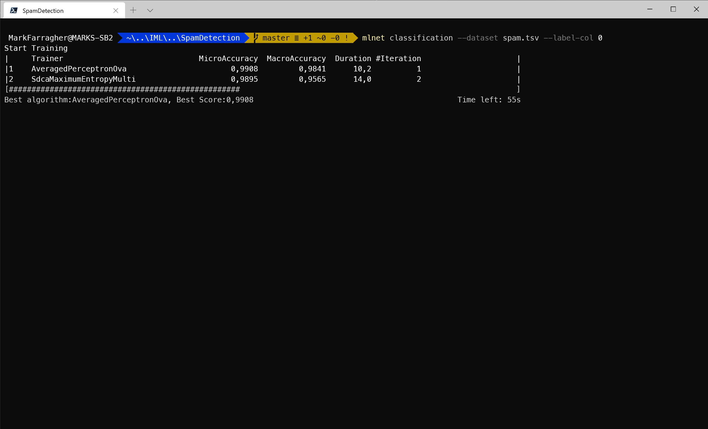
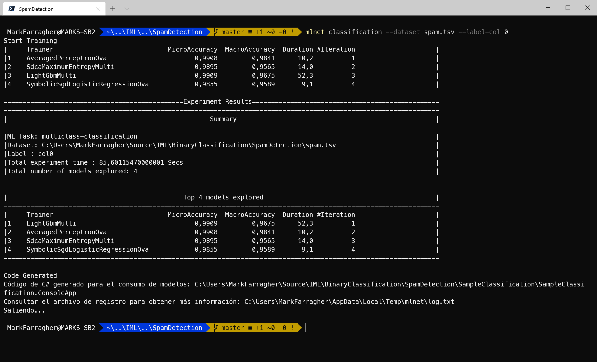
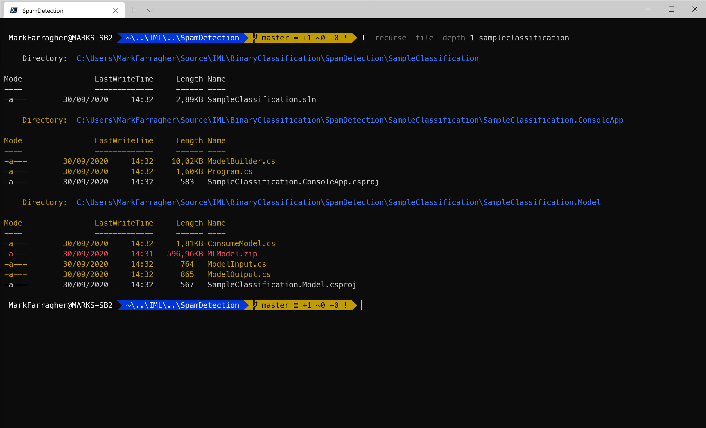
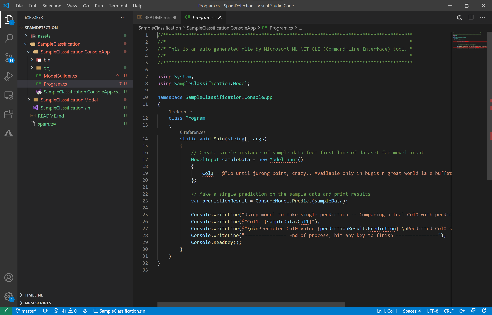
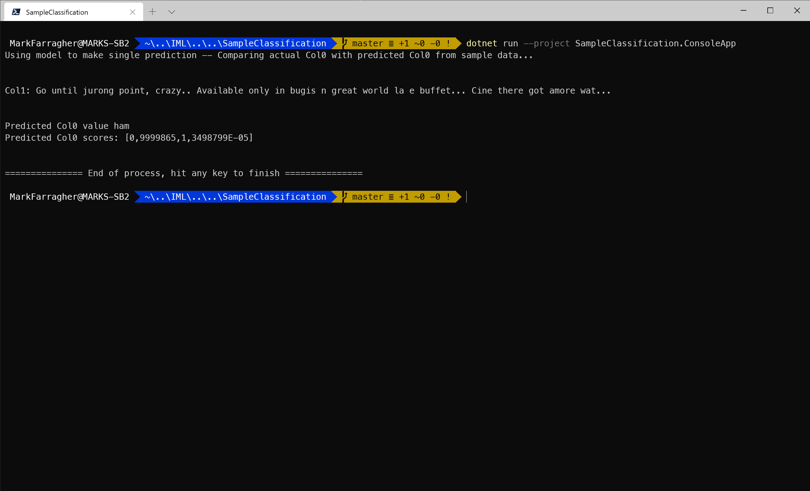
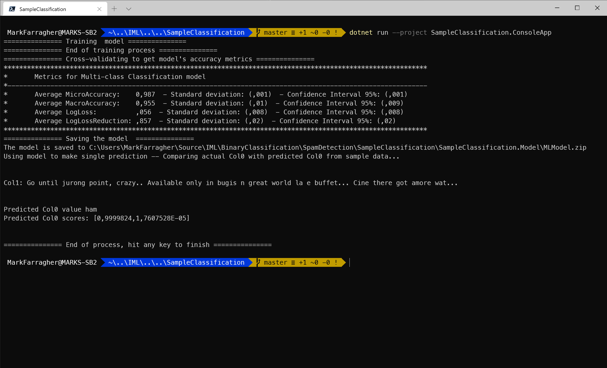

# Assignment: Detect spam messages

To this day, spam remains a massive problem in online communications.

The term 'spamming' refers to the use of messaging systems to send an unsolicited message ('spam') to large numbers of recipients for the purpose of commercial advertising. The most common form of spam is email spam, but similar abuses happen in other media too: instant messaging spam, search engine spam, mobile SMS spam, spam apps, tv spam, and so on.


Spamming remains economically viable because advertisers have no operating costs beyond the management of their mailing lists and mail servers, and it is difficult to hold senders accountable for their mass mailings. The costs are borne by the public and by ISPs who need to add extra capacity to cope with the massive data traffic volume.

Fortunately, laws have been introduced that make spamming illegal in more and more countries. 

In this assignment we're going to look at SMS spamming: the act of sending unsolicited SMS spam messages to mobile phone users. We're going to try and build a machine learning model that can weed out spam messages and keep all legitimate messages.

## Get the dataset

Our dataset is the UCI SMS Spam Collection, a a set of SMS messages that have been collected for spam research. It contains 5574 English SMS messages, tagged according being legitimate or spam.

This messages have been collected from various sources on the Internet:

* 425 SMS spam messages were taken from the Grumbletext Web site. This is a UK forum in which cell phone users make public claims about SMS spam messages. 
* 3,375 randomly chosen non-spam messages from the NUS SMS Corpus (NSC), which is a dataset of about 10,000 legitimate messages collected for research at the Department of Computer Science at the National University of Singapore.
* 450 non-spam messages collected from Caroline Tag's PhD Thesis on spam research.
* 1,002 non-spam and 322 spam messages from the SMS Spam Corpus v.0.1 Big. This is a public spam database for academic research.

You can download the dataset [here](https://github.com/mdfarragher/DSC/blob/master/BinaryClassification/SpamDetection/spam.tsv). Make sure to save it as **spam.tsv** in your project folder.

The data file looks like this:


It’s a TSV file with only 2 columns of information:

* Label: ‘spam’ for a spam message and ‘ham’ for a normal message.
* Message: the full text of the SMS message.

You will build a binary classification model that reads in all messages and then makes a prediction for each message if it is spam or ham.

To start, please open a console window. You are going to create a folder to hold the files of this assignment:

```bash
mkdir SpamDetection
cd SpamDetection
```

Also make sure to copy the dataset files into this folder. 

## Train the model

Now you're ready to start training a machine learning model. Please type the following command in your console window:

```bash
mlnet classification --dataset spam.tsv --label-col 0
```

Note that the --label-col parameter refers to column 0 because this dataset does not have column headers. 

Here's what the running app looks like in Windows Terminal:



The tool has loaded the dataset and is now randomly trying out machine learning algorithms and algorithm parameters to create the best possible spam predictions.

You can see that at the point of the screenshot, the tool has already tried out 2 different machine learning algorithms, these are listed in the **Training** column. 

The performance of each algorithm is listed in the **MicroAccuracy** and **MacroAccuracy** columns. The tool uses the MicroAccuracy value to keep track of the best algorithm to date, which is shown in the final line of text. 

In the screenshot, the best algorithm is AveragedPerceptronOva which achieved a MicroAccuracy of 0.9908 (bigger is better). This happened in experiment 1. 

The tool continues to try out algorithms until a set time period has expired. The default period is 100 seconds, at which the tool selects the winning algorithm.

Here's what that looks like:



After 4 experiments, the tool has selected LightGbmMulti as the winning algorithm. It achieved a winning MicroAccuracy value of 0.9909.

The tool has created a C# app for us and placed the project files in the **SampleClassification** folder.

## Inspect the C# code

Let's check the files agail that the CLI tool has created. Run the following Powershell command on the console:

```bash
l -recurse -file -depth 1 sampleclassification
```

You'll see the following output:



There are three folders:

* **SampleClassification**: The solution folder for the generated app containing a single SLN file for Visual Studio.
* **SampleClassification/SampleClassification.ConsoleApp**: A console project that consumes the fully-trained model to make a prediction. There's also a **ModelBuilder.cs** file which can train the model from scratch.
* **SampleClassification/SampleClassification.Model**: A library project with helper classes for training and consuming the model. There's also a ZIP file with a saved copy of the fully-trained model which can be consumed right away without any further training. 

So again, you have two possible scenarios for building your own heart disease prediction app:

* Load the ZIP file with the fully-trained model and start making predictions right away. You'll need to link the **SampleClassification.Model** project into your own solution, and then use the code in **SampleClassification.ConsoleApp/Program.cs** as a starting point to consume the model. 
* Train your own model from scratch. You'll need to link the **SampleClassification.Model** project into your own solution, and then use the code in **SampleClassification.ConsoleApp/ModelBuilder.cs** as a starting point to train your model. You'll also need to put the CSV training file in your project directory. 

### The SampleClassification.ConsoleApp project

We've already inspected the generated code twice when we covered regression. So let's do a quick scan to see how the act of classification has changed the generated code.

Go to the SampleRegression folder and open Visual Studio code:

```bash
cd SampleClassification
code .
```

In Visual Studio Code, select the **SampleClassification.ConsoleApp/Program.cs** file. You'll see something like this:



The code sets up a new message with text: _"Go until jurong point, crazy.. Available only in bugis n great world la e buffet... Cine there got amore wat..."_. It then runs a prediction to determine if this message is spam or not. 

Let's run this app to make sure everything works. 

Type the following on the console:

```bash
dotnet run --project SampleClassification.ConsoleApp
```

This will run the app and show the following:



The model predicts that the given text is not spam, with a probability of 99.99%.

### The SampleClassification.Model project

Now let's take a peek at the **ModelInput** class. 

Select the **SampleClassification.Model/ModelInput.cs** file in Visual Studio Code. You'll see that it looks like this:

```csharp
public class ModelInput
{
    [ColumnName("col0"), LoadColumn(0)]
    public string Col0 { get; set; }

    [ColumnName("col1"), LoadColumn(1)]
    public string Col1 { get; set; }

}
```

The dataset doesn't have column headers, so the mlnet tool used **Col0** and **Col1** as column names. And note the presence of **LoadColumn** attributes that help the csv loader figure out which dataset columns go where. 

Let's continue our code inspection. 

Here's what the **ModelOutput.cs** file looks like:

```csharp
public class ModelOutput
{
    // ColumnName attribute is used to change the column name from
    // its default value, which is the name of the field.
    [ColumnName("PredictedLabel")]
    public String Prediction { get; set; }
    public float[] Score { get; set; }
}
```

The prediction is in a string property called **Predicton**, and the probabilities are in a float array called **Score**. We have two possible predictions (ham or spam) so this array will have 2 elements. 

The prediction is a **string** because it exactly matches the values in the label column in the dataset. So if a message is spam, the prediction value will be 'spam'. 

### The ModelBuilder class

Finally, let's take a look at the **ModelBuilder** class in the ConsoleApp project.

Select the **SampleClassification.ConsoleApp/ModelBuilder.cs** file in Visual Studio Code. 

The interesting part is the **BuildTrainingPipeline** method that creates the machine learning classification pipeline. What will it look like for this dataset?

Well, check this out. This is what I got:

```csharp
public static IEstimator<ITransformer> BuildTrainingPipeline(MLContext mlContext)
{
    // Data process configuration with pipeline data transformations 
    var dataProcessPipeline = mlContext.Transforms.Conversion.MapValueToKey("col0", "col0")
                                .Append(mlContext.Transforms.Text.FeaturizeText("col1_tf", "col1"))
                                .Append(mlContext.Transforms.CopyColumns("Features", "col1_tf"));
    // Set the training algorithm 
    var trainer = mlContext.MulticlassClassification.Trainers.LightGbm(labelColumnName: "col0", featureColumnName: "Features")
                                .Append(mlContext.Transforms.Conversion.MapKeyToValue("PredictedLabel", "PredictedLabel"));

    var trainingPipeline = dataProcessPipeline.Append(trainer);

    return trainingPipeline;
}
```

Here is a breakdown of the components in the pipeline:

* A **MapValueToKey** component that takes the label (which is a string) and convers it to a key: a numerical value that the machine learning model can work with.  
* A **FeaturizeText** component which calculates a numerical value for each message. This is a required step because machine learning models cannot handle text data directly.
* A **CopyColumns** component which copies the featurized text into a new columnn called 'Features'.
* A **LightGbm** trainer to train the modeol. 
* A final **MapKeyToValue** component that converts the key that the model predicts back to its corresponding label value.

The FeaturizeText component is a very nice solution for handling text input data. The component performs a number of transformations on the text to prepare it for model training:

* Normalize the text (=remove punctuation, diacritics, switching to lowercase etc.)
* Tokenize each word.
* Remove all stopwords
* Extract Ngrams and skip-grams
* Perform TF-IDF rescaling
* Perform a bag of words conversion

The result is that each message is converted to a vector of numeric values that can easily be processed by the model.

Now let's check out the **Evaluate** method:

```csharp
private static void Evaluate(MLContext mlContext, IDataView trainingDataView, IEstimator<ITransformer> trainingPipeline)
{
    // Cross-Validate with single dataset (since we don't have two datasets, one for training and for evaluate)
    // in order to evaluate and get the model's accuracy metrics
    Console.WriteLine("=============== Cross-validating to get model's accuracy metrics ===============");
    var crossValidationResults = mlContext.MulticlassClassification.CrossValidate(trainingDataView, trainingPipeline, numberOfFolds: 5, labelColumnName: "col0");
    PrintMulticlassClassificationFoldsAverageMetrics(crossValidationResults);
}
```

The dataset is a single unpartitioned file, so the code will perform K-Fold Cross Validation to partition the dataset in 5 folds and calculate the average classification metrics over all folds. 

But check out that **MulticlassClassification.CrossValidate** method.

The ML.NET CLI tool made a mistake again. We only have two possible label values: spam or not spam, and so we're supposed to treat this as a binary classification problem, not multiclass classification.

I asked Microsoft about this, and they told me that they don't support binary clasification at all in the tool. They said the optimal training pipelines for binary classification and multiclass classification are virtually the same, so we end up with the same optimized solution anyway and there's no need to treat both cases separately.

Unfortunately this decision does have a disadvantage: we can't see the binary classification metrics. We know the micro accuracy of the model, but not the precision, recall, or AUC.

For now, we'll leave the code as is and continue to work with the micro accuracy. 

Let's tweak the console application now to retrain the model from scratch before making a prediction. 

Select the **SampleClassification.ConsoleApp/Program.cs** file in Visual Studio Code, and add the following code to the top of the Main method, before any other code:

```csharp
// train the model from scratch
ModelBuilder.CreateModel();
```

This will ensure that the console program calls the model builder to retrain the model and ignore the ZIP file. And after training we should see the single prediction for the test message.

Now execute the following command on the console:

```bash
dotnet run --project SampleClassification.ConsoleApp
```

You'll see this:



The model gets trained from scratch and evaluated, and now we see the K-Fold Cross Validation metrics. 

With 5 folds, we're seeing an average micro accuracy of 0.987 with a standard deviation of 0.001. The macro average is slightly lower at 0.955 and has a larger standard deviation of 0.01.

These are pretty good results. The standard deviations are small which indicates that the 5 fold metrics are all bunched close together. This suggests that the patterns in the dataset are nicely spaced out over the entire file, and we can safely partition the file in a training and a testing set. 

Retraining had no impact on the model prediction: our test message is still rated at 99.99% ham.  

## Observations

Note how easy it is to train a model on text data. All you need to do is add a **FeaturizeText** component to the training pipeline and you're done. 

The component performs a set of standard transformations on the text to remove punctuation and stopwords, and then converts the text to a vector of numbers that the model can train on. 

We are achieving a crazy high micro accuracy of 99.09% during training. It seems as if the problem of spam is history!

Well, not so fast.

English text is complex. There are about a million distinct words in the English language, and thousands of different ways to say the same thing. This is a massive amount of information for the machine learning model to wade through. 

To capture all of this complexity, typical language training datasets are measured in _terabytes_, not gigabytes!

For a text dataset, our spam file is very small and therefore the model has no trouble learning it completely.

But if we were to show the fully trained model some new messages that it has not yet seen before, we would see that it does not perform very well at all. The model would really struggle to accurately detect spam.

Do you remember what this effect is called? When a model does really well on training but not very well at all on new data?

Exactly. This is classic overfitting. 

To combat overfitting, we need a much bigger dataset.

## Improve the model

For this assignment, I want you to use a different text dataset. You're going to train a model on the famous IMDB Movie Review dataset. 

You can grab the dataset from Kaggle [here](https://www.kaggle.com/lakshmi25npathi/imdb-dataset-of-50k-movie-reviews).

The dataset is a single CSV file called **IMDB Dataset.csv** with two data columns:

* The text of a movie review on IMDB
* The text 'positive' if the movie review is positive, or 'negative' if the review is negative.

There are 50,000 reviews in the dataset, ten times more than the number of messages in the spam dataset we've used until now.

I want you to download the IMDB dataset, and then run the ML.NET CLI tool on this file. You can use the following command:

```bash
mlnet classification --dataset "IMDB Dataset.csv" --label-col 1
```

Note that the label column is now column 1, the second column in the dataset.

Run this command. 

Which micro-accuracy do you get? 

## Homework

Please report your results on the IMDB movie review challenge online to get entered into our hall of fame.


Click the following link to access the online submission form on your PC or mobile: 

[https://forms.office.com/Pages/ResponsePage.aspx....](https://forms.office.com/Pages/ResponsePage.aspx?id=cDwqJ-Givk-T_qyHkmGIbU3xYGpQDIZMlmak2FZVNMJUOUdYUkU5SFgwNjVZUEE2NFFKMlJMMEVLSi4u)

And then in the form please report the following:

* Your name
* The dataset you're using (= **IMDB Movie Reviews**)
* The columns you used in your best model
* The learning algorithm you used in your best model
* The metric you used to evaluate your model (= **MicroAccuracy**)
* The micro accuracy value of your best model

I will periodically compile all submissions into a top-10 hall of fame and share the list in my courses and on social media. 

You'll be famous!

And feel free to brag about your results in our Slack group ;) 

Good luck!
