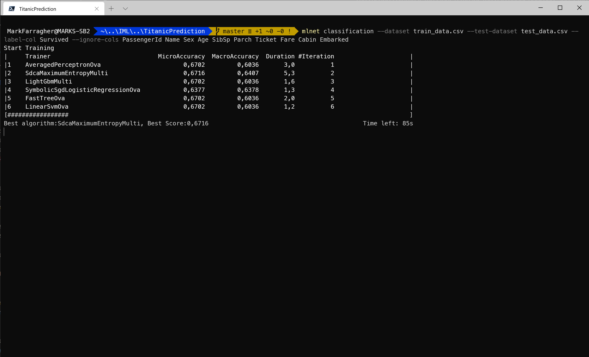
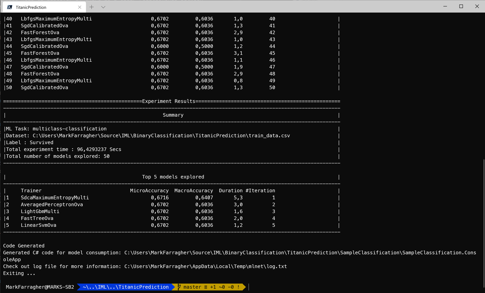
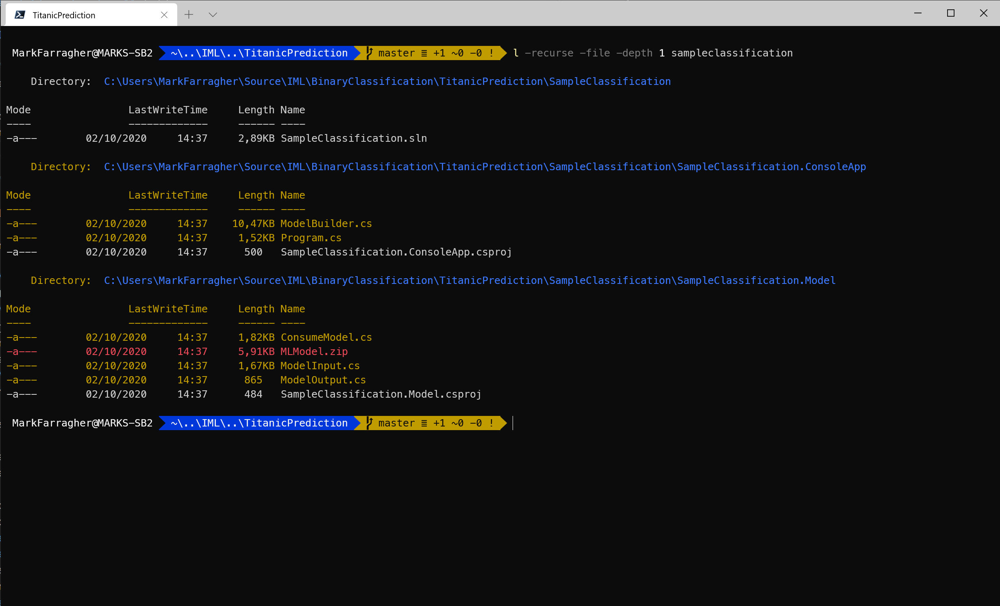
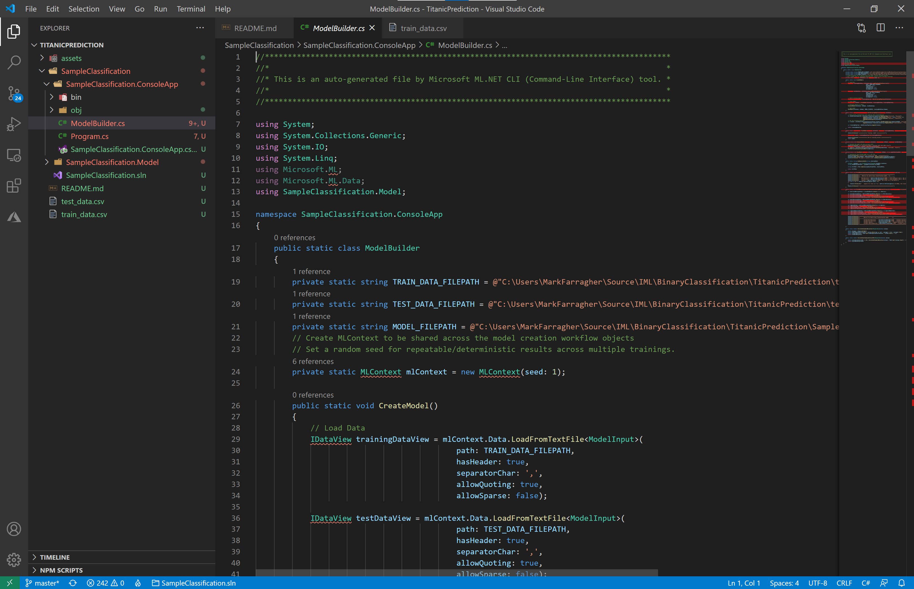
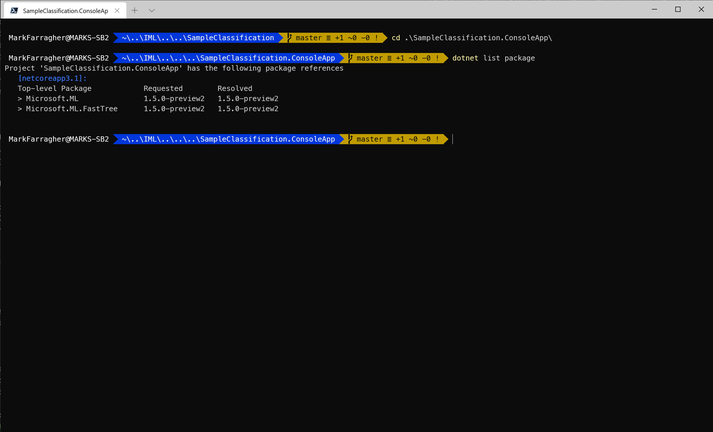
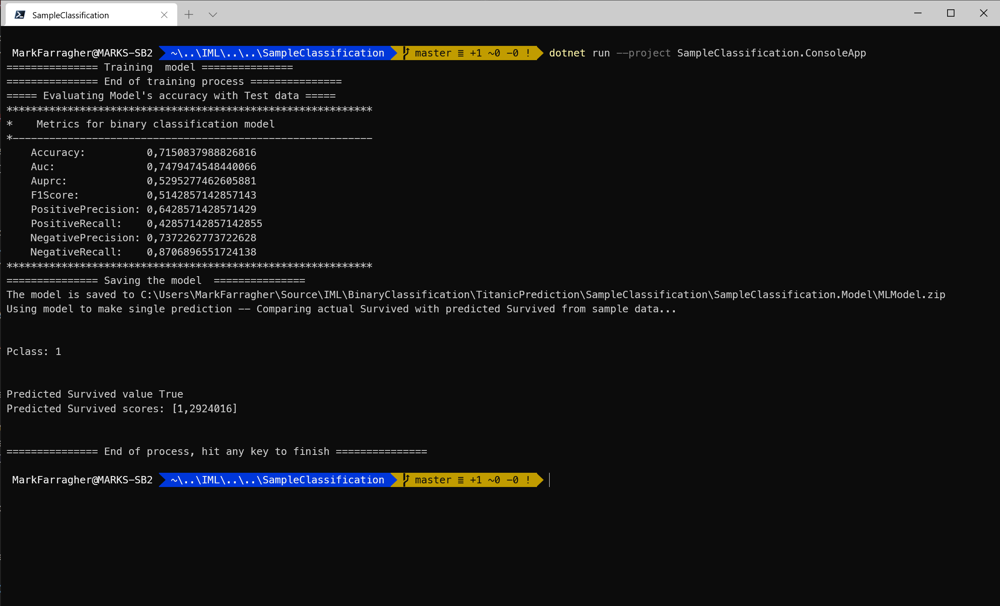

# Assignment: Predict who survived the Titanic disaster

The sinking of the Titanic is one of the most infamous shipwrecks in history.

On April 15, 1912, during her maiden voyage, the widely considered “unsinkable” RMS Titanic sank after colliding with an iceberg. Unfortunately, there weren’t enough lifeboats for everyone onboard, resulting in the death of 1502 out of 2224 passengers and crew.


While there was some element of luck involved in surviving, it seems some groups of people were more likely to survive than others.

So in 2012, the well-known machine learning collaboration platform Kaggle issued a challenge: can we build a model that can accurately predict what sorts of people were more likely to survive the disaster, based on passenger data like the name, age, gender, and socio-economic class?

Kaggle provided a dataset with a fragment of the Titanic passenger manifest. The file contains personal information on 891 passengers, together with a label column that indicates if they survived the disaster or perished. 

The challenge is still ongoing. The top teams on the leaderboard have achieved a maxed-out accuracy of 100%.  

Do you think you can match this achievement? 

In this assignment you're going to build an app that can predict which Titanic passengers survived the disaster. You will use a decision tree classifier to make your predictions.

## Get the dataset

To start, please open a console window. You are going to create a folder to hold the files of this assignment:

```bash
mkdir TitanicPrediction
cd TitanicPrediction
```

To train your app, you will need the passenger manifest of the Titanic's last voyage. You will use the famous **Kaggle Titanic Dataset** which has data for a subset of 891 passengers.

Download the [test_data.csv](https://github.com/mdfarragher/DSC/blob/master/BinaryClassification/TitanicPrediction/test_data.csv) and [train_data.csv](https://github.com/mdfarragher/DSC/blob/master/BinaryClassification/TitanicPrediction/train_data.csv) files and save them to your project folder.

The training data file looks like this:


It’s a CSV file with 12 columns of information:

* The passenger identifier
* The label column containing ‘1’ if the passenger survived and ‘0’ if the passenger perished
* The class of travel (1–3)
* The name of the passenger
* The gender of the passenger (‘male’ or ‘female’)
* The age of the passenger, or ‘0’ if the age is unknown
* The number of siblings and/or spouses aboard
* The number of parents and/or children aboard
* The ticket number
* The fare paid
* The cabin number
* The port in which the passenger embarked

The second column is the label: 0 means the passenger perished, and 1 means the passenger survived. All other columns are input features from the passenger manifest.

You're gooing to build a binary classification model that reads in all columns and then predicts for each passenger if he or she survived.

## Train the model

Now you're ready to start training a machine learning model. Please type the following command in your console window:

```bash
mlnet classification --dataset train_data.csv --test-dataset test_data.csv --label-col Survived --ignore-cols PassengerId Name Sex Age SibSp Parch Ticket Fare Cabin Embarked
```

Note the --ignore-cols parameter. We are training the machine learning model on the **Pclass** column (= the passenger class) and ignore everything else. 

This will help us discover if there is a clear relationship between passenger class and survival chances.

Here's what the running app looks like in Windows Terminal:



The tool has loaded the dataset and is now randomly trying out machine learning algorithms and algorithm parameters to create the best possible spam predictions.

You can see that at the point of the screenshot, the tool has already tried out 6 different machine learning algorithms, these are listed in the **Training** column. 

The performance of each algorithm is listed in the **MicroAccuracy** and **MacroAccuracy** columns. The tool uses the MicroAccuracy value to keep track of the best algorithm to date, which is shown in the final line of text. 

In the screenshot, the best algorithm is SdcaMaximumEntropyMulti which achieved a MicroAccuracy of 0.6716 (bigger is better). This happened in experiment 2. 

The tool continues to try out algorithms until a set time period has expired. The default period is 100 seconds, at which the tool selects the winning algorithm.

Here's what that looks like:



After 50 experiments, the tool has kept SdcaMaximumEntropyMulti as the winning algorithm with a micro accuracy value of 0.6716.

The tool has created a C# app for us and placed the project files in the **SampleClassification** folder.

## Inspect the C# code

Let's check the files that the CLI tool has created. Run the following Powershell command on the console:

```bash
l -recurse -file -depth 1 sampleclassification
```

You'll see the following output:



We get the three usual folders again:

* **SampleClassification**: The solution folder for the generated app containing a single SLN file for Visual Studio.
* **SampleClassification/SampleClassification.ConsoleApp**: A console project that consumes the fully-trained model to make a prediction. There's also a **ModelBuilder.cs** file which can train the model from scratch.
* **SampleClassification/SampleClassification.Model**: A library project with helper classes for training and consuming the model. There's also a ZIP file with a saved copy of the fully-trained model which can be consumed right away without any further training. 

Note that the ML.NET CLI tool has again created a multiclass classification solution for us, despite the fact that a Titanic survivor analysis is a binary classification problem. So we cannot view any binary metrics yet.

Let's fix that and hack the code to adapt it for binary classification.

We're also going to edit the machine learning pipeline and change the training algorithm. The tool picked SdcaMaximumEntropyMulti, but since this is a section on decision trees, we're going to change this to a decision tree algorithm instead. 

Go to the SampleClassification folder and open Visual Studio code:

```bash
cd SampleClassification
code .
```

In Visual Studio Code, select the **SampleClassification.ConsoleApp/ModelBuilder.cs** file. You'll see something like this:



Now locate the **EvaluateModel** method and change it to this:

```csharp
private static void EvaluateModel(MLContext mlContext, ITransformer mlModel, IDataView testDataView)
{
    // Evaluate the model and show accuracy stats
    Console.WriteLine("===== Evaluating Model's accuracy with Test data =====");
    IDataView predictions = mlModel.Transform(testDataView);
    var metrics = mlContext.BinaryClassification.Evaluate(predictions, "Survived", "Score");
    PrintBinaryClassificationMetrics(metrics);
}
```

Easy, right? We just changed the word 'Multiclass' to 'Binary'. This code will do a binary classification evaluation and then print the corresponding metrics. 

Next, we need to add a new method called **PrintBinaryClassificationMetrics** to display the binary classification metrics.

So add the following method to the **ModelBuilder.cs** file:

```csharp
public static void PrintBinaryClassificationMetrics(BinaryClassificationMetrics metrics)
{
    Console.WriteLine($"************************************************************");
    Console.WriteLine($"*    Metrics for binary classification model");
    Console.WriteLine($"*-----------------------------------------------------------");
    Console.WriteLine($"    Accuracy:          {metrics.Accuracy}");
    Console.WriteLine($"    Auc:               {metrics.AreaUnderRocCurve}");
    Console.WriteLine($"    Auprc:             {metrics.AreaUnderPrecisionRecallCurve}");
    Console.WriteLine($"    F1Score:           {metrics.F1Score}");
    Console.WriteLine($"    PositivePrecision: {metrics.PositivePrecision}");
    Console.WriteLine($"    PositiveRecall:    {metrics.PositiveRecall}");
    Console.WriteLine($"    NegativePrecision: {metrics.NegativePrecision}");
    Console.WriteLine($"    NegativeRecall:    {metrics.NegativeRecall}");
    Console.WriteLine($"************************************************************");
}
```

This code prints the usual binary classification metrics:

* **Accuracy**: this is the number of correct predictions divided by the total number of predictions.
* **AreaUnderRocCurve**: a metric that indicates how accurate the model is: 0 = the model is wrong all the time, 0.5 = the model produces random output, 1 = the model is correct all the time. An AUC of 0.8 or higher is considered good.
* **AreaUnderPrecisionRecallCurve**: an alternate AUC metric that performs better for heavily imbalanced datasets with many more negative results than positive.
* **F1Score**: this is a metric that strikes a balance between Precision and Recall. It’s useful for imbalanced datasets with many more negative results than positive.
* **PositivePrecision**: also called ‘Precision’, this is the fraction of positive predictions that are correct. This is a good metric to use when the cost of a false positive prediction is high.
* **PositiveRecall**: also called ‘Recall’, this is the fraction of positive predictions out of all positive cases. This is a good metric to use when the cost of a false negative is high.
* **NegativePrecision**: this is the fraction of negative predictions that are correct.
* **NegativeRecall**: this is the fraction of negative predictions out of all negative cases.

Next, we need to fix the machine learning pipeline. Right now it's using a multiclass classification algorithm and we need to change that to a binary decision tree.

So scroll up until you see the **BuildTrainingPipeline** method, and then change it to this:

```csharp
public static IEstimator<ITransformer> BuildTrainingPipeline(MLContext mlContext)
{
    // Data process configuration with pipeline data transformations 
    var dataProcessPipeline = mlContext.Transforms.Concatenate("Features", new[] { "Pclass" })
                                .Append(mlContext.Transforms.NormalizeMinMax("Features", "Features"))
                                .AppendCacheCheckpoint(mlContext);
    // Set the training algorithm 
    var trainer = mlContext.BinaryClassification.Trainers.FastTree(labelColumnName: "Survived", featureColumnName: "Features");

    var trainingPipeline = dataProcessPipeline.Append(trainer);

    return trainingPipeline;
}
```

I made two changes:

* I removed the **MapValueToKey** and **MapKeyToValue** components. These are ony required for multiclass classification, so they can go. 

* I removed the **SdcaMaximumEntropy** multiclass classification trainer and replaced it with a **FastTree** binary classification trainer.

Now go to the **SampleClassification.Model/ModelInput.cs** file and change the **Survived** property to this:

```csharp
[ColumnName("Survived"), LoadColumn(1)]
public bool Survived { get; set; }
```

I've changed the type from string to a bool. Binary classification always produces boolean predictions, so the labels in the dataset need to have the same type.

And we need to make one more change. 

Go to the **SampleClassification.Model/ModelOutput.cs** file and change the class to this:

```csharp
public class ModelOutput
{
    // ColumnName attribute is used to change the column name from
    // its default value, which is the name of the field.
    [ColumnName("PredictedLabel")]
    public bool Prediction { get; set; }
    public float Probability { get; set; }
    public float Score { get; set; }
}
```

I've changed **Prediction** to a bool. We're doing binary classification so the predictions need to be boolean true/false values.

And note that **Score** and **Probability** are not arrays but floats. Since we have only 2 output categories (a healthy patient or a sick patient), the model only outputs the score and probability of the true case (a sick patient). Since the probabilities add up to 100%, we can easily calculate the other probability if we need it. 

With these changes, the **ModelBuilder** class is ready for binary classification. 

Now let's tweak the console application. 

We have made breaking changes to the machine learning pipeline so the zip file on disk with the fully trained model is no longer valid. We'll need to retrain the model from scratch and overwrite the zip file with a valid version.

So select the **SampleClassification.ConsoleApp/Program.cs** file in Visual Studio Code, and add the following code to the top of the Main method, before any other code:

```csharp
// train the model from scratch
ModelBuilder.CreateModel();
```

This will ensure that the console program calls the model builder to retrain the model and ignore the zip file. And after training we should see the new binary classification metrics we added to the code.

We're almost done, there is only one more edit remaining. 

FastTree decision trees are not available by default but must be loaded as a NuGet package first. So we have to add the package to the ConsoleApp project.

Go to the console and type the following:

```bash
cd SampleClassification.ConsoleApp
dotnet list package
```

This is what I see:



The ML.NET CLI tool installed on my laptop uses version 1.5.0-preview2 of the ML.NET machine learning library. And so I need to install that exact same version of the decision tree package to avoid incompatibilities.

So this is what I typed to install the package. Make sure you type the version number that corresponds to what you're seeing when you list the packages:

```bash
dotnet add package Microsoft.ML.FastTree -v 1.5.0-preview2
```

The **-v** parameter at the end requests a specific version of the package, in my case 1.5.0-preview2.

This command has added the FastTree NuGet package to the ConsoleApp project and made fast decision trees available for training.

Now execute the following commands on the console to run the app:

```bash
cd ..
dotnet run --project SampleClassification.ConsoleApp
```

If you have made all the changes correctly, you'll see this:



The model gets trained from scratch and evaluated, and now we see the new binary classification metrics. 

We're achieving an accuracy of 71.50%. The precision is 0.6428 and the recall is 0.4285. The AUC is 0.7479 which indicates fair predictive quality. 

The model is saved to a ZIP file and then consumed to make a single prediction. And the model predicts that a first-class passenger would have survived the Titanic disaster.

## Observations

You will have noticed that the AUC is not very good. With a value of 0.7479, our model is making only fair predictions. 

This is of course because we're only looking at the passenger class. There are many more interesting data columns in the dataset that we could use. 

How does gender affect survival chances? Was being a man or a woman a handicap or a benefit during the evacuation? 

How did age affect the survival rates? Did the young passengers fare better than the old? Or did the stewards prioritize older people when filling the lifeboats? 

The AUC and accuracy will probably improve a lot if we allow the model to observe all relevant columns in the dataset to look for survival patterns.

## Improve the model

I want you to run the app again, but now with all relevant columns included. 

Go to the **BuildTrainingPipeline** method and change the **Concatenate** component so that it uses all relevant input columns. 

What are the relevant columns?

That's for you to decide! Choose the columns that you think will influence the survival rate of Titanic passengers. And leave out any columns that you don't think are relevant. 

Then run the console app again. 

Which AUC value do you get now? 

Feel free to experiment with different combinations of columns to get the best possible result. 

## Homework

Once you've found your best-performing model, I want you to make the following predictions:

* What is the probability of survival for a 30 year old single man without children travelling 1st class? And how about 2nd and 3rd class?
* Now change the gender. What is the probability of survival for a 30 year old single woman without children travelling 1st class? And 2nd and 3rd class?
* Now let's look at families. Take a 30 year old man and woman with two children in 1st, 2nd or 3rd class. What are their odds? Calculate the survival for the man and woman separately. Who had better odds?

Do you see any patterns emerging?

And like always, please report the valuation metrics of your best performing model online to get entered into our hall of fame.


Click the following link to access the online submission form on your PC or mobile: 

[https://forms.office.com/Pages/ResponsePage.aspx....](https://forms.office.com/Pages/ResponsePage.aspx?id=cDwqJ-Givk-T_qyHkmGIbU3xYGpQDIZMlmak2FZVNMJUOUdYUkU5SFgwNjVZUEE2NFFKMlJMMEVLSi4u)

And then in the form please report the following:

* Your name
* The dataset you're using (= **Titanic Survival**)
* The columns you used in your best model
* The learning algorithm you used in your best model (Can be **FastTree** but feel free to try others too)
* The metric you used to evaluate your model (= **AUC**)
* The AUC value of your best model

I will periodically compile all submissions into a top-10 hall of fame and share the list in my courses and on social media. 

You'll be famous!

And feel free to brag about your results in our Slack group ;) 

Good luck!
