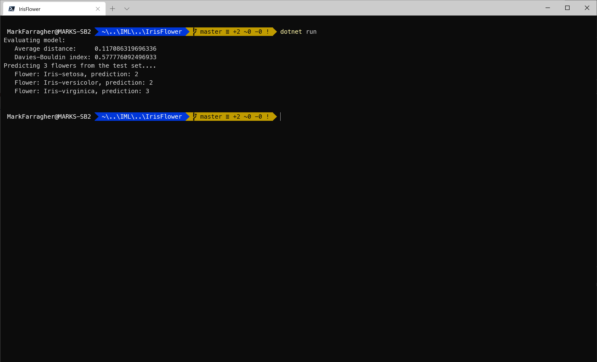

# Assignment: Classify unlabeled Iris flowers

**Iris** are flowering plants with showy flowers. They take their name from the Greek word for a rainbow. They are popular garden flowers.

There are many types of Iris flowers, but we are going to focus on three of them: the Iris versicolor, Iris setosa, and Iris virginica:


In 1936, the British statistician, eugenicist, and biologist Ronald Fisher published a paper called 'The use of multiple measurements in taxonomic problems' in which he tried to quantify the differences between the three Iris varieties based on the size of their petals and sepals.

He worked with a dataset of flowers collected in the Gaspé Peninsula "all from the same pasture, and picked on the same day and measured at the same time by the same person with the same apparatus". Fisher's paper was published in the journal 'the Annals of Eugenics'.

The Fisher data set consists of 50 samples from each of three species of Iris. Four features were measured from each sample: the length and the width of the sepals and petals, in centimeters. Based on the combination of these four features, Fisher developed a mathematical model to distinguish the species from each other.

The nice thing about the Fisher dataset is that perfect predictions are only possible with supervised learning, by training a machine learning model on the labels.

If we apply unsupervised learning, we discover that the dataset only has 2 clear clusters: one with Iris setosa, and one with Iris versacolor and Iris virginica mashed together.

This makes the Fisher dataset a perfect tool to illustrate the difference between supervised and unsupervised learning, and drive the point home that cluster numbers do not necessarily map onto labels.

In this assignment, you're going to create an unsupervised learning model and train it on the Fisher dataset. You will not use the label and rely entirely on clustering to predict each type of flower.

How accurately will your clusters match the labels in the dataset?

## Prepare the app

Now let’s get started creating the C# app. 

Unfortunately we cannot use the ML.NET CLI tool to automatically generate the app for us. The tool cannot yet create clustering apps.

So we're going to have to write the app entirely by hand. Fortunately this is very easy. The entire program is only about 100 lines long!

Let's start by setting up a new C# console application. Go to the command line and run the following command:

```bash
dotnet new console -o IrisFlower
cd IrisFlower
```

This will create a new C# console application called **IrisFlower**.

Next, you need to install the NuGet package for ML.NET:

```bash
dotnet add package Microsoft.ML
```

And that's it! You now have a new (but empty) C# console application with machine learning support. 

Next, we need to download the dataset

## Get the dataset

You can download the Iris dataset [from here](https://github.com/mdfarragher/DSC/blob/master/Clustering/IrisFlower/iris-data.csv). Save the file as **iris-data.csv** in your project folder.

The file looks like this:


It’s a CSV file with 5 columns:

* The length of the Sepal in centimeters
* The width of the Sepal in centimeters
* The length of the Petal in centimeters
* The width of the Petal in centimeters
* The type of Iris flower

## Write the code

You are going to build an app that trains a clustering model on the dataset and then guesses the label for each flower in the dataset.

Of course the app won't know the real names of the flowers, so it's just going to number them: 1, 2, and 3.

Let’s get started creating the C# app. 

Run the following console command to open the main code file in Visual Studio Code:

```bash
code Program.cs
```

Delete all the code in this file, we're going to start over from scratch.

Then type the following code:

```csharp
using Microsoft.ML;
using Microsoft.ML.Data;
using System;
using System.Linq;
```

This sets up a couple of **using** statements so that we can easily access machine learning classes without having to prefix them with long namespaces.

Next, you need to declare one class to hold a single flower measurement and one class to hold a single model prediction.

Add the following code to set up these classes:

```csharp
namespace IrisFlower
{
    /// <summary>
    /// A data transfer class that holds a single iris flower.
    /// </summary>
    public class IrisData
    {
        [LoadColumn(0)] public float SepalLength;
        [LoadColumn(1)] public float SepalWidth;
        [LoadColumn(2)] public float PetalLength;
        [LoadColumn(3)] public float PetalWidth;
        [LoadColumn(4)] public string Label;
    }

    /// <summary>
    /// A prediction class that holds a single model prediction.
    /// </summary>
    public class IrisPrediction
    {
        [ColumnName("PredictedLabel")]
        public uint ClusterID;

        [ColumnName("Score")]
        public float[] Score;
    }

    // the rest of the code goes here....
}
```

The **IrisData** class holds one single flower measurement. Note how the fields are tagged with the **LoadColumn** attribute that tells ML.NET how to load the data from the CSV file.

We are loading the label in the 4th column (counting from zero), but we won't be using the label during training because we want the model to figure out the iris flower species on its own.

There's also an **IrisPrediction** class which will hold a prediction for a single flower. The prediction is the unique identifier of the cluster that the flower belongs to. Clusters are numbered from 1 upwards. 

And notice how the score field is an array? Each individual score value represents the distance of the flower measurement to one specific cluster centroid. The **ClusterID** prediction corresponds to the cluster with the lowest **Score** value.   

Next you'll need to load the dataset:

```csharp
// The main program class.
class Program
{
    // The program entry point.
    static void Main(string[] args)
    {
        var mlContext = new MLContext();

        // read the iris flower data from a text file
        var data = mlContext.Data.LoadFromTextFile<IrisData>(
            path: "iris-data.csv", 
            hasHeader: false, 
            separatorChar: ',');

        // split the data into a training and testing partition
        var partitions = mlContext.Data.TrainTestSplit(data, testFraction: 0.2);

        // the rest of the code goes here....
    }
}
```

This code uses the **LoadFromTextFile** method to load the CSV data directly into memory, and then calls **TrainTestSplit** to split the dataset into an 80% training partition and a 20% test partition.

Now let’s build the machine learning pipeline:

```csharp
// set up a learning pipeline
// step 1: concatenate features into a single column
var pipeline = mlContext.Transforms.Concatenate(
        "Features", 
        "SepalLength")

    // step 2: use k-means clustering to find the flower species
    .Append(mlContext.Clustering.Trainers.KMeans(
        featureColumnName: "Features",
        numberOfClusters: 3));

// train the model on the data file
var model = pipeline.Fit(partitions.TrainSet);

// the rest of the code goes here...
```

This pipeline has two components:

* **Concatenate** which concatenates all input columns into a single column called 'Features'. This is a required step because ML.NET can only train on a single input column.
* A **KMeans** component which performs K-Means Clustering on the data and tries to find all Iris flower species. 

Note that the **Concatenate** component only captures the **SepalLength** column and ignores the other three flower measurements. To keep things simple, we're going to do a quick test run on only a single input column.  

With the pipeline fully assembled, the code trains the model with a call to **Fit**.

You now have a fully- trained model. So now it's time to take the test set, predict the species of each flower, and calculate the evaluation metrics of the model:

```csharp
// evaluate the model
Console.WriteLine("Evaluating model:");
var predictions = model.Transform(partitions.TestSet);
var metrics = mlContext.Clustering.Evaluate(
    predictions, 
    scoreColumnName: "Score", 
    featureColumnName: "Features");
Console.WriteLine($"   Average distance:     {metrics.AverageDistance}");
Console.WriteLine($"   Davies-Bouldin index: {metrics.DaviesBouldinIndex}";

// the rest of the code goes here....
```

This code calls **Transform** to set up predictions for every flower in the test set, and **Evaluate** to evaluate the predictions and automatically calculate two metrics:

* **AverageDistance**: this is the average distance of a flower to a cluster centroid, averaged over all clusters in the dataset. It is a measure for the 'tightness' of the clusters. Lower values are better and mean more concentrated clusters. 
* **DaviesBouldinIndex**: this metric combines the average distance to the cluster centroids with the average separation between any cluster pair in the dataset. It combines both the 'tightness' of individual clusters with the separation between clusters. Lower values indicate better clustering, with tighter clusters spaced further apart.

So Average Distance measures how concentrated the clusters are in the dataset, and the Davies Bouldin Index measures both concentration and how far apart the clusters are spaced. For both metrics lower values are better, with zero being the perfect score.

To wrap up, let’s use the model to make predictions.

You will pick three arbitrary flowers from the test set, run them through the model, and compare the predictions with the labels provided in the data file.

Here’s how to do it:

```csharp
// show predictions for a couple of flowers
Console.WriteLine("Predicting 3 flowers from the test set....");
var flowers = mlContext.Data.CreateEnumerable<IrisData>(partitions.TestSet, reuseRowObject: false).ToArray();
var flowerPredictions = mlContext.Data.CreateEnumerable<IrisPrediction>(predictions, reuseRowObject: false).ToArray();
foreach (var i in new int[] { 0, 10, 20 })
{
    Console.WriteLine($"   Flower: {flowers[i].Label}, prediction: {flowerPredictions[i].ClusterID}");
}
```

This code calls the **CreateEnumerable** method to convert the test partition into an array of **IrisData** instances, and the model predictions into an array of **IrisPrediction** instances. 

Then the code picks three flowers for testing. For each flower it writes the label and the cluster ID (= a number between 1 and 3) to the console. 

That's it, the app is done!

You can run the app like this:

```bash
dotnet run
```

You should see the following output:



The average distance of a flower prediction to the cluster centroids is 0.12 centimers, and the Davies-Bouldin index is 0.58.

The flower predictions are wrong, though. Our three random flowers are one setosa, one versicolor, and one virginica. But the model has confused the setosa with the versicolor and grouped them both in cluster 2.

## Observations

The Davies-Bouldin index doesn't tell us much. Is 0.58 good or bad? We simply don't know, we can only use this metric to compare one model to another. 

But we can see from the individual flower predictions that the model is not very good. For our three distinct test flowers, the model has incorrectly grouped two of them together in cluster 2. This is obviously wrong. 

The reason for this is very simple: we are only using the **SepalLength** to train on. 

Remember the training pipeline with the **Concatenate** component? It's only looking at the sepal length and ignoring the three other measurements. 

Our model is impaired because we haven't trained it on all available data.

## Improve the model

So I want you to run the app again, but now with all relevant columns included. 

Edit the app and modify the **Concatenate** component. Make sure you include all 4 flower measurements so that the model gets trained on all relevant input columns. 

Then run the console app again. 

Which average cluster centroid distance and Davies-Bouldin Index do you get now? 

## Homework

Once you've fixed the app, I want you to modify the code to generate predictions for all flowers in the test set and calculate the **Accuracy** metric.

This is very easy. Just make a prediction for every flower and keep track of all correct predictions. Then divide the total number of correct predictions by the number of flowers in the test set. The resulting number is the accuracy. 

How accurate are your model predictions? Is the app able to uniquely identify each flower species? And if not, which species does it struggle with? 

I also want you to report your Davies-Bouldin Index online to get entered into our hall of fame.


Click the following link to access the online submission form on your PC or mobile: 

[https://forms.office.com/Pages/ResponsePage.aspx....](https://forms.office.com/Pages/ResponsePage.aspx?id=cDwqJ-Givk-T_qyHkmGIbU3xYGpQDIZMlmak2FZVNMJUOUdYUkU5SFgwNjVZUEE2NFFKMlJMMEVLSi4u)

And then in the form please report the following:

* Your name
* The dataset you're using (= **Iris Flowers**)
* The columns you used in your best model
* The learning algorithm you used in your final model (= **K-Means Clustering**)
* The metric you used to evaluate your model (= **Davies-Bouldin Index**)
* The Davies-Bouldin Index value of your final model

I will periodically compile all submissions into a top-10 hall of fame and share the list in my courses and on social media. 

You'll be famous!

And feel free to brag about your results in our Slack group ;) 
