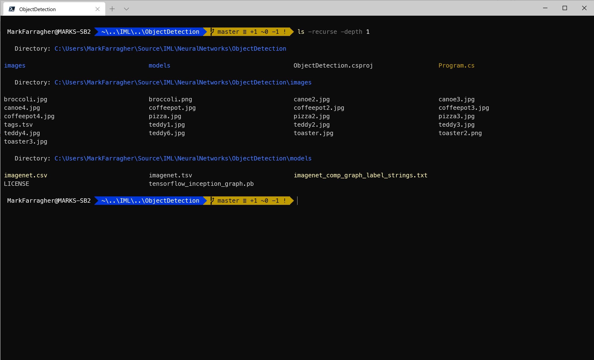
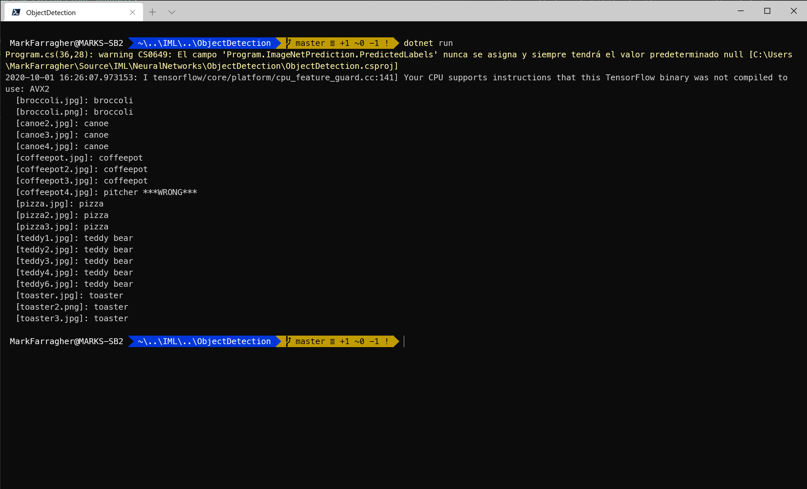

# Assignment: Detect objects in images

There’s an old saying in AI that computers are great at things that humans find hard (like doing complex math) and computers really struggle with things that humans find easy (like catching a ball or recognizing objects).

Let’s take recognizing objects as an example. Check out the following collection of images:


These 20 images depict a broccoli, a canoe, a coffee pot, a pizza, a teddy bear, and a toaster. How hard would it be to build an app that can recognize the object in every image?

Really hard, actually.

In fact, it’s so difficult that there’s an annual challenge called the **ImageNet Large Scale Visual Recognition Challenge**. The challenge requires apps to classify a collection of 1.2 million images into 1,000 unique categories.

Here are the competition results up to 2016:


The red line depicts the 5% human error rate on the image classification challenge. Only in 2015 did a team finally develop an app that could beat human performance levels.

You may think that the answer is yes, but that you'll have to build a deep neural network in C# and train it on the 1.2 million images in the ImageNet dataset. It would take weeks to fully train the model.

But there’s no need to go through all that trouble. Fully-trained object-detection networks are readily available and you can easily host and run a neural network that has already been trained.

In this assignment, you will use the well-known Google Inception model to build an object detector and attempt to correctly identify all 20 test images.

Here's a closeup of the internal structure of the Inception model:


You can look inside neural networks with Netron, a popular model viewer that you can install from here: https://github.com/lutzroeder/netron. 

The cool thing about the Inception model is that it has three convolution kernels that run in paralel. The kernels are highlighted in red in the image. This structure repeats in many layers throughout the entire neural network.

This paralel architecture with three convolutional kernels in each image layer gives Inception excellent predictive ability on a wide range of images.

## Prepare the app

Now let’s get started creating the C# app. 

Unfortunately we cannot use the ML.NET CLI tool to automatically generate the app for us. The tool cannot yet create image classification apps.

So we're going to have to write the app entirely by hand. Fortunately this is very easy. The entire program is only about 100 lines long!

Let's start by setting up a new C# console application. Go to the command line and run the following command:

```bash
dotnet new console -o ObjectDetection
cd ObjectDetection
```

This will create a new C# console application called **ObjectDetection**.

Next, you need to install three NuGet packagess: one for ML.NET, one for image processing, and one for TensorFlow support:

```bash
dotnet add package Microsoft.ML
dotnet add package Microsoft.ML.ImageAnalytics
dotnet add package Microsoft.ML.TensorFlow
```

And that's it! You now have a new (but empty) C# console application with machine learning support. 

Next, we need to download the dataset

## Get the dataset

Let's start with the set of 20 test images. You can grab them from [here](#). Unzip the archive and save the images in an **images** subfolder in your project folder.

The images should look like this:


If you look closely at the images, you'll notice that there's also a **tags.tsv** file. This file associates every image with its corresponding label. 

The file has only 2 columns of data:

* The filename of the image to test
* The label that describes what's in the image

We will need this file to verify if our C# app is making the correct predictions for each image.

## Get the model

In this assignment we're not going to train a model from scratch on a training dataset. Doing so would take too long, and require the original 1.2 milion image dataset from the ImageNet challenge.

Instead, we're going to download the fully trained model and use it out of the box. 

You can donwload the model from [here](#). Unzip the archive and place the files in a **models** subfolder in your project folder. 

To verify if you have every file in its correct place, run the following console command:

```bash
ls -recurse -depth 1
```

You should see the following output:



There's an **ObjectDetection.csproj** project file, a **Program.cs** code file, the **images** subfolder with the 20 test images and the **tags.tsv** file, and the **models** subfolder with the fully trained model. 

## Write the code

Now let’s get started creating the C# app. 

Run the following console command to open the code file in Visual Studio Code:

```bash
code Program.cs
```

Delete all the code in this file, we're going to start over from scratch.

Then type the following code:

```csharp
using System;
using System.Collections.Generic;
using System.IO;
using System.Linq;
using Microsoft.ML;
using Microsoft.ML.Data;
```

This sets up a couple of **using** statements so that we can easily access machine learning classes without having to prefix them with long namespaces.

Next, you need to declare one class to hold a single image and one class to hold a single model prediction.

Add the following code to set up these classes:

```csharp
namespace ImageDetector
{
    // The application class
    class Program
    {
        // A data class that holds data for one image
        public class ImageNetData
        {
            [LoadColumn(0)] public string ImagePath;
            [LoadColumn(1)] public string Label;

            // Load the tags.tsv file
            public static IEnumerable<ImageNetData> ReadFromCsv(string file)
            {
                return File.ReadAllLines(file)
                    .Select(x => x.Split('\t'))
                    .Select(x => new ImageNetData 
                    { 
                        ImagePath = x[0], 
                        Label = x[1] 
                    });
            }
        }

        // A prediction class that holds only a model prediction.
        public class ImageNetPrediction
        {
            [ColumnName("softmax2")]
            public float[] PredictedLabels;
        }

        // the rest of the code goes here...
    }
}
```

The **ImageNetData** class holds all the data for one single image. Note how each field is tagged with a **LoadColumn** attribute that tells the CSV data loading code which column to import the data from.

There’s also a **ReadFromCsv** method which manually reads a file and returns a sequence of **ImageNetData** objects. You will need this method later on.

And finally, there is an **ImageNetPrediction** class which holds one  single model prediction.

In the ImageNet challenge, the models need to classify each image into one of 1,000 possible classes. And so **PredictedLabels** is a **float** array with 1,000 probability values; one for each possible class.

Now you're going to load the **tags.tsv** file:

```csharp
// The main application entry point.
static void Main(string[] args)
{
    // create a machine learning context
    var mlContext = new MLContext();

    // load the TSV file with image names and corresponding labels
    var data = mlContext.Data.LoadFromTextFile<ImageNetData>("images/tags.tsv", hasHeader: true);

    // the rest of the code goes here...
}
```

This code uses the method **LoadFromTextFile** to load the TSV data directly into memory. The class field annotations tell the method how to store the CSV columns in the **ImageNetData** class.

Next, let's set up the machine learning pipeline:

```csharp
// set up a learning pipeline
var pipeline = mlContext.Transforms

    // step 1: load the images
    .LoadImages(
        outputColumnName: "input", 
        imageFolder: "images", 
        inputColumnName: nameof(ImageNetData.ImagePath))

    // step 2: resize the images to 224x224
    .Append(mlContext.Transforms.ResizeImages(
        outputColumnName: "input", 
        imageWidth: 224, 
        imageHeight: 224, 
        inputColumnName: "input"))

    // step 3: extract pixels in a format the TF model can understand
    // these interleave and offset values are identical to the images the model was trained on
    .Append(mlContext.Transforms.ExtractPixels(
        outputColumnName: "input", 
        interleavePixelColors: true, 
        offsetImage: 117))

    // step 4: load the TensorFlow model
    .Append(mlContext.Model.LoadTensorFlowModel("models/tensorflow_inception_graph.pb")

    // step 5: score the images using the TF model
    .ScoreTensorFlowModel(
        outputColumnNames: new[] { "softmax2" },
        inputColumnNames: new[] { "input" }, 
        addBatchDimensionInput:true));
            
// train the model on the data file
var model = pipeline.Fit(data);
```

Machine learning models in ML.NET are built with pipelines, which are sequences of data-loading, transformation, and learning components.

This pipeline has the following components:

* **LoadImages** which loads the test images from disk. The component needs the name of the input column holding the file names, the folder in which to look for images, and the name of a new pipeline column to load the images into.
* **ResizeImages** which resizes images. This is a required step because the Inception model has been trained on 224x224 pixel images. So we need to present our images using the same size for the model to work (*)
* **ExtractPixels** which flattens the image data into a 1-dimensional array of floats. Note that we interleave color channels and use an offset of 117, because that’s what the Inception model has been trained on (*)
* **LoadTensorFlowModel** which will load the fully trained Inception model (which is a TensorFlow model) from disk.
* **ScoreTensorFlowModel** which will feed the image data into the TensorFlow model and collect the prediction scores.

(*) As a rule when working with pre-trained neural networks, we need to preprocess our images in the exact same way as the data the network has been trained on. In case of ImageNet this means resizing all images to 224x224, interleaving color channels, and using a pixel offset value of 117.

The **ScoreTensorFlowModel** component requires the name of the input node that will receive the image data and the name of the output node that holds the softmax predictions.

We can easily find these nodes by viewing the Inception model in Netron. 

Check it out, this is the top of the neural network with the input layer. You can see from the image that it has an id of **input**:


And here is the very bottom of the neural network with the classification layer that makes the final predictions. You can see from the image that it has an id of **softmax2**:


So the two node names we have to provide to **ScoreTensorFlowModel** are **"input"** and **"softmax2"**.

With the pipeline fully assembled, we can train the model with a call to **Fit**.

Note that the **Fit** method doesn’t actually do anything here. The TensorFlow model is already fully trained and all model parameters are frozen. So in this case, the Fit method just assembles the pipeline and returns a model instance.

To wrap up, We're going to create a prediction engine to make predictions for each image in the dataset:

```csharp
// create a prediction engine
var engine = mlContext.Model.CreatePredictionEngine<ImageNetData, ImageNetPrediction>(model);
```

We use the **CreatePredictionEngine** method to set up a prediction engine. The two type arguments are the input data class and the class to hold the prediction.

Next, we're going to load the complete list of ImageNet labels from a text file stored in the Inception model folder:

```csharp
// load all 1,000 ImageNet labels
var labels = File.ReadAllLines("models/imagenet_comp_graph_label_strings.txt");
```

This is just a list of all 1,000 unique ImageNet class labels. We need this file to match each model predictions to its corresponding label so we know what the model 'sees' in the image.

We're also going to load the 20 test images with their labels:

```csharp
// load the test images
var images = ImageNetData.ReadFromCsv("images/tags.tsv");
```

Our final step is to use the prediction engine to make a prediction for each image in the set:

```csharp
foreach (var image in images)
{
    Console.Write($"  [{image.ImagePath}]: ");

    // make a prediction for the image
    var prediction = engine.Predict(image).PredictedLabels;

    // find the highest probability in the set of 1,000 values
    var i = 0;
    var best = (from p in prediction 
                select new { Index = i++, Prediction = p }).OrderByDescending(p => p.Prediction).First();

    // map that probability to its corresponding label
    var predictedLabel = labels[best.Index];

    Console.WriteLine($"{predictedLabel} {(predictedLabel != image.Label ? "***WRONG***" : "")}");
}
```

This code loops through each image and calls **Predict** to make a prediction. That gives us an array of 1,000 floats with probabilities for  each class.

In other words, prediction[1] is the probability that the image contains a Kit Fox, prediction[2] is the probability that the image contains an English Setter, and so on.

We are only interested in the best prediction, so the code uses a LINQ query to find the highest value and the corresponding class label.

That's it, the app is done!

You can run the app like this:

```bash
dotnet run
```

You should see the following output:



## Observations

The app is quite fast and can identify an image in a fraction of a second. It does a really good job on the test set and correctly identifies 19 out of 20 images. That’s an accuracy of 95%.

The app only made one single mistake and predicted that coffeepot4.jpg is actually a pitcher of water.

If you take a closer look at the test images, you'll understand why. Coffee pot number #4 is square and looks a lot like a water pitcher. The unusual shape confused the model. 


## Homework

Normally I'd ask you to improve this model as much as you can, and then report your best evaluation metrics in our hall of fame. 

Unfortunately the Inception model is already pre-trained and we can't improve it any further. 

So instead, I have a new assignment for you. 

In the TV show [Silicon Valley](https://en.wikipedia.org/wiki/Silicon_Valley_(TV_series)), there's a famous scene where software developer Jian-Yang demonstrates an app that can identify any kind of food in an image. Of course this being Silicon Valley, there's a catch: the app can only identify hotdogs and classifies everything else as 'not hotdog':


You can watch the full video here: [https://www.youtube.com/watch?v=pqTntG1RXSY](https://www.youtube.com/watch?v=pqTntG1RXSY&feature=youtu.be)

I want you to collect a bunch of hotdog and not-hotdog images and then use the Inception model to predict if there's a hotdog in the images. 

'Hotdog' is actually one of the ImageNet classes (class 886 to be precise), so your app should be able to replicate the behavior of the fictional Silicon Valley app. 

How good is your app at identifying hotdogs? Could you turn this into the next killer app? 😅
