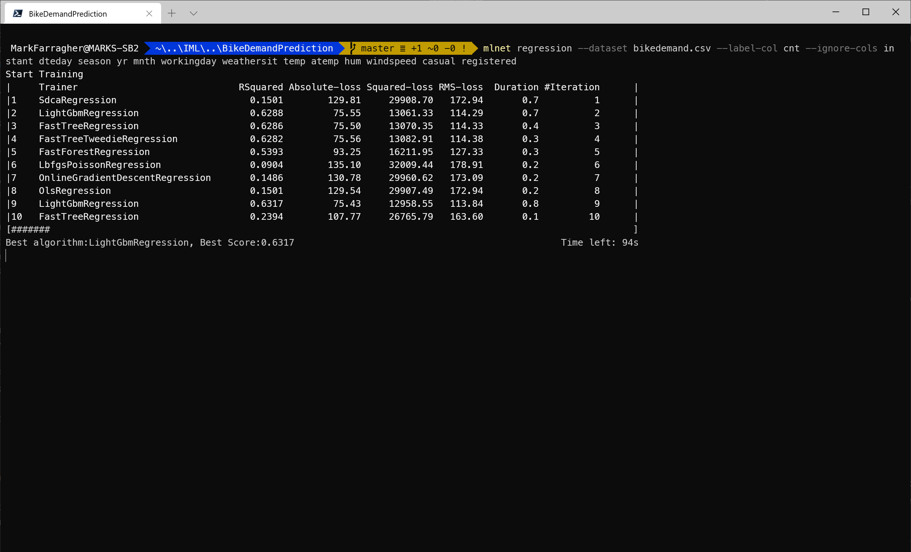
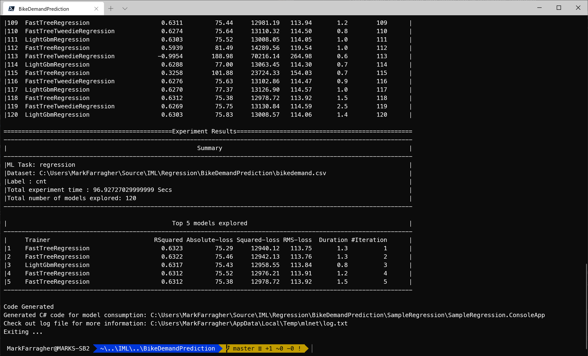
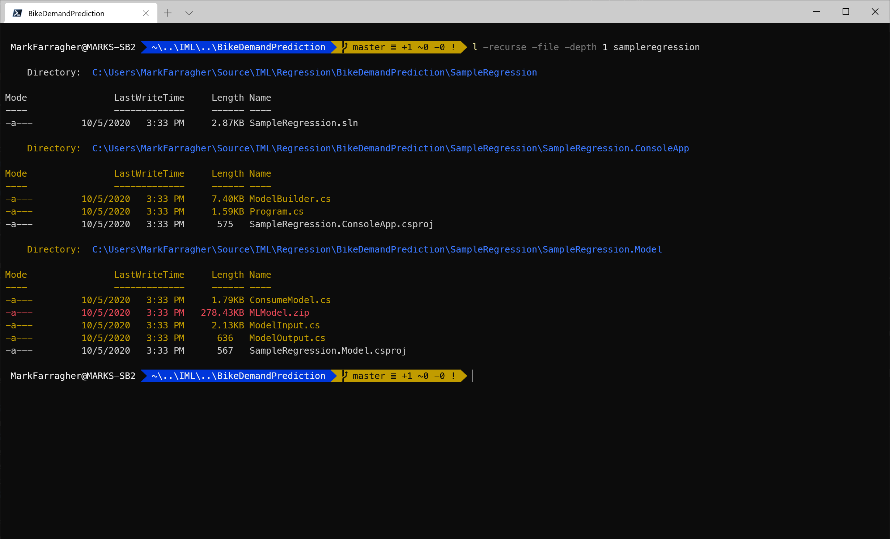
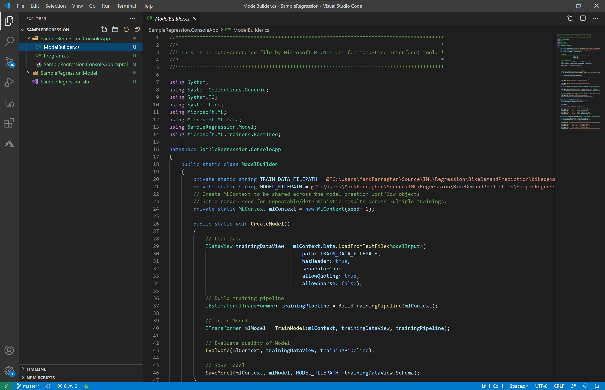
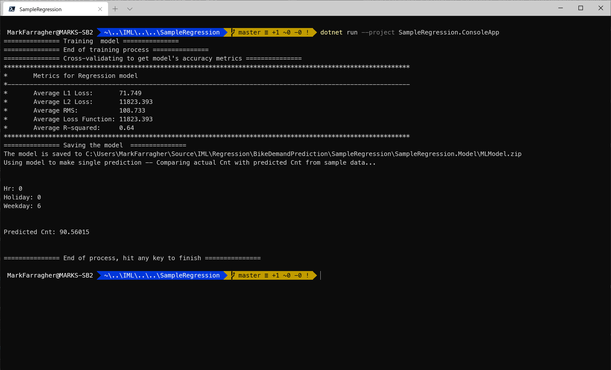

# Assignment: Predict bike sharing demand in Washington

Bike sharing systems are a means of renting bicycles where the process of becoming a member, renting a bike, and returning the bike are all automated via a network of kiosk locations throughout a city. Using these systems, people are able rent a bike from a one location and return it to a different place on an as-needed basis.

Users use their mobile phone to unlock a bike from a dock and return it later at another dock belonging to the same system. Docks are bike racks that lock the bike and only release it by computer control. They look like this:


Bike sharing companies are continuously moving bikes around town to try and even out supply and demand. They are also servicing bikes, repairing defects, and returning fresh bikes to the system. 

The bike sharing companies need to know how many bikes will be in demand at any given time in the city so they can plan their logistic operations accordingly. 

So let’s give them a hand with a machine learning model.

## Get the dataset

To start, please open a console window. You are going to create a folder to hold the files of this assignment:

```bash
mkdir BikeSharing
cd BikeSharing
```

We are going to train a machine learning model on a dataset with lots of bike sharing demand numbers. We'll use the UCI Bike Sharing Dataset from Capital Bikshare, a bike sharing company in the Metro DC area. This dataset was compiled in 2013 and has 17,380 bike sharing records that span a 2-year period.

You can [download the dataset here](https://github.com/mdfarragher/IML/blob/master/Regression/BikeDemandPrediction/bikedemand.csv). Please save it in your project folder as **bikedmand.csv**.

The training data file looks like this:


The file looks like this:


It’s a comma-separated file with 17 columns:

* instant: the record index
* dteday: the date of the observation
* season: the season (1 = springer, 2 = summer, 3 = fall, 4 = winter)
* yr: the year of the observation (0 = 2011, 1 = 2012)
* mnth: the month of the observation ( 1 to 12)
* hour: the hour of the observation (0 to 23)
* holiday: if the date is a holiday or not
* weekday: the day of the week of the observation
* workingday: if the date is a working day
* weathersit: the weather during the observation (1 = clear, 2 = mist, 3 = light snow/rain, 4 = heavy rain)
* temp : the normalized temperature in Celsius
* atemp: the normalized apparent temperature in Celsius
* hum: the normalized humidity
* windspeed: the normalized wind speed
* casual: the number of casual bike users at the time
* registered: the number of registered bike users at the time
* cnt: the total number of rental bikes in operation at the time

You can ignore the record index, the date, and the number of casual and registered bikes, and use everything else as input features. The final column **cnt** is the label you're trying to predict.

You're gooing to build a regression model that reads in all columns and then predicts how many bikes are required for every date and time in the dataset.

## Train the model

Now you're ready to start training a machine learning model. Please type the following command in your console window:

```bash
mlnet regression --dataset bikedemand.csv --label-col cnt --ignore-cols instant dteday season yr mnth workingday weathersit temp atemp hum windspeed casual registered
```

Note the --ignore-cols parameter. We are only training the machine learning model on the **hour**, **weekday** and **holiday** columns and ignore everything else. 

Hopefully the model will pick up on a weekly and hourly pattern, and adjust for holidays accordingly. 

Run this command on the console.

Here's what the running app looks like in Windows Terminal:



The tool has loaded the dataset and is now randomly trying out machine learning algorithms and algorithm parameters to create the best possible predictions.

You can see that at the point of the screenshot, the tool has already tried out 10 different machine learning algorithms, these are listed in the **Training** column. 

The performance of each algorithm is listed in the **RSquared** and **Absolute-loss (MAE)** columns. The tool uses the R-squared value to keep track of the best algorithm to date, which is shown in the final line of text. 

In the screenshot, the best algorithm is LightGbmRegression which achieved an R-squared of 0.6317 (bigger is better). This happened in experiment 9.

You can also look at the Absolute-loss column, also known as the Mean Absolute Error (MAE). The best algorithm has an MAE of 75.43, meaning its predictions are off by 75 bikes on average. 

The tool continues to try out algorithms until a set time period has expired. The default period is 100 seconds, at which the tool selects the winning algorithm.

Here's what that looks like:



After 120 experiments, the tool has selected FastTreeRegression as the winning algorithm with an R-squared value of 0.6323, a RMSE of 113.75 and a MAE of 75.29.

The tool has created a C# app for us and placed the project files in the **SampleRegression** folder.

## Inspect the C# code

Let's check the files that the CLI tool has created. Run the following Powershell command on the console:

```bash
ls -recurse -file -depth 1 sampleregression
```

You'll see the following output:



We get the three usual folders again:

* **SampleRegression**: The solution folder for the generated app containing a single SLN file for Visual Studio.
* **SampleRegression/SampleRegression.ConsoleApp**: A console project that consumes the fully-trained model to make a prediction. There's also a **ModelBuilder.cs** file which can train the model from scratch.
* **SampleRegression/SampleRegression.Model**: A library project with helper classes for training and consuming the model. There's also a ZIP file with a saved copy of the fully-trained model which can be consumed right away without any further training. 

## Inspect the C# code

Go to the SampleRegression folder and open Visual Studio code:

```bash
cd SampleRegression
code .
```

In Visual Studio Code, select the **SampleRegression.ConsoleApp/ModelBuilder.cs** file. You'll see something like this:



Now locate the **BuildTrainingPipeline** method. It should look like this:

```csharp
public static IEstimator<ITransformer> BuildTrainingPipeline(MLContext mlContext)
{
    // Data process configuration with pipeline data transformations 
    var dataProcessPipeline = mlContext.Transforms.Concatenate("Features", new[] { "hr", "holiday", "weekday" });
    // Set the training algorithm 
    var trainer = mlContext.Regression.Trainers.FastTree(new FastTreeRegressionTrainer.Options() { NumberOfLeaves = 17, MinimumExampleCountPerLeaf = 1, NumberOfTrees = 500, LearningRate = 0.18660869f, Shrinkage = 0.09739763f, LabelColumnName = "cnt", FeatureColumnName = "Features" });

    var trainingPipeline = dataProcessPipeline.Append(trainer);

    return trainingPipeline;
}
```

This pipeline contains the following components:

* A **Concatenate** component that combines all input columns into a single column called 'Features' for training. 
* A **FastTree** learning algorithm that will train the model on the data.

The **FastTree** machine learning algorithm is a regression decision tree. And we know from the previous course lectures that decision trees are prone to overfitting. 

The MAE on our predictions is 75 bikes which is quite a lot, so the model is probably not overfitting yet. But let's not take any changes and replace the algorithm with a bagging ensemble of decision trees. This will lower the variance and protect the model from overfitting. 

A bagging ensemble of fast decision trees is a very popular machine learning algorithm. So popular in fact that it is commonly referred to as a **FastForest**, and the ML.NET library supports it out of the box.

So I want you to edit the BuildTrainingPipeline method and change the line that assigns the trainer to this:

```csharp
var trainer = mlContext.Regression.Trainers.FastForest(new FastForestRegressionTrainer.Options() { NumberOfLeaves = 17, MinimumExampleCountPerLeaf = 1, NumberOfTrees = 500, LearningRate = 0.18660869f, Shrinkage = 0.09739763f, LabelColumnName = "cnt", FeatureColumnName = "Features" });
```

We just changed 'FastTree' to 'FastForest' and kept all the hyperparameters. We're now using a bagging ensemble of trees instead.

Now go to the **SampleRegression.ConsoleApp/Program.cs** file in Visual Studio Code, and add the following code to the top of the Main method, before any other code:

```csharp
// train the model from scratch
ModelBuilder.CreateModel();
```

This will ensure that the console program calls the model builder to retrain the model using a bagging ensemble of decision trees. 

That's it, we're done!

Let's test the app by running it. Type the following command on the console to run the app:

```bash
dotnet run --project SampleRegression.ConsoleApp
```

If you have made all the changes correctly, you'll see this:



The model gets trained from scratch and evaluated using a bagging ensemble of decision trees, and now we see new evaluation metrics. 

We're achieving an R-squared of 0.64, a RMSE of 108.73 and a MAE (also called the L1-loss) of 71.749. 

How about that? The MAE actually improved and we're better protected against overfitting. It's a win-win ;) 

## Observations

Our model is now only looking at the weekday, the hour, and if the day is a holiday or not, and making bike predictions with a mean absolute error of 71 bikes. That's a great start. 

It shows that there is a strong temporal pattern in the bike demand numbers. Every hour of the day will have roughly equal number of bikes on the street day after day, and every day of the week will have roughly equal number of bikes on the street week after week. There's an hourly pattern and a daily pattern superimposed on another.

On holidays the number of bikes will be higher, but we are taking this into account by also training on the **holiday** column. The model sees this extra information and can adjust its predictions accordingly.

The only factor we're completely ignoring is the weather. On cold, windy and rainy days, we expect far fewer people on bikes than normal. So we should really train on the weather columns too. 

## Improve the model

I want you to run the app again, but now with all relevant columns included. 

Go to the **BuildTrainingPipeline** method and change the **Concatenate** component so that it uses all relevant input columns. 

What are the relevant columns?

That's for you to decide! Choose the columns that you think will generate the best predictions. And leave out any columns that you don't think are relevant. 

Then run the console app again. 

Which R-squared, MAE and RMSE value do you get now? 

Feel free to experiment with different combinations of columns to get the best possible result. 

## Homework

Once you've found your best-performing model, I want you to report the evaluation metrics online to get entered into our hall of fame.


Click the following link to access the online submission form on your PC or mobile: 

[https://forms.office.com/Pages/ResponsePage.aspx....](https://forms.office.com/Pages/ResponsePage.aspx?id=cDwqJ-Givk-T_qyHkmGIbU3xYGpQDIZMlmak2FZVNMJUOUdYUkU5SFgwNjVZUEE2NFFKMlJMMEVLSi4u)

And then in the form please report the following:

* Your name
* The dataset you're using (= **Washington Bike Demand**)
* The columns you used in your best model
* The learning algorithm you used in your best model (Can be **FastForest** but feel free to try others too)
* The metric you used to evaluate your model (= **RMSE**)
* The RMSE value of your best model

I will periodically compile all submissions into a top-10 hall of fame and share the list in my courses and on social media. 

You'll be famous!

And feel free to brag about your results in our Slack group ;) 

Good luck!
