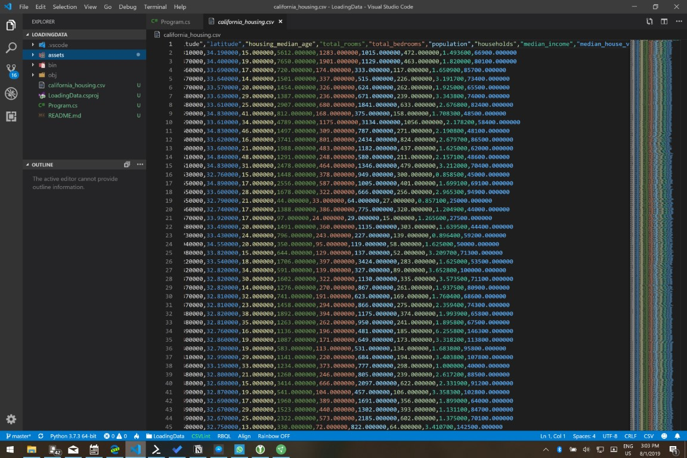
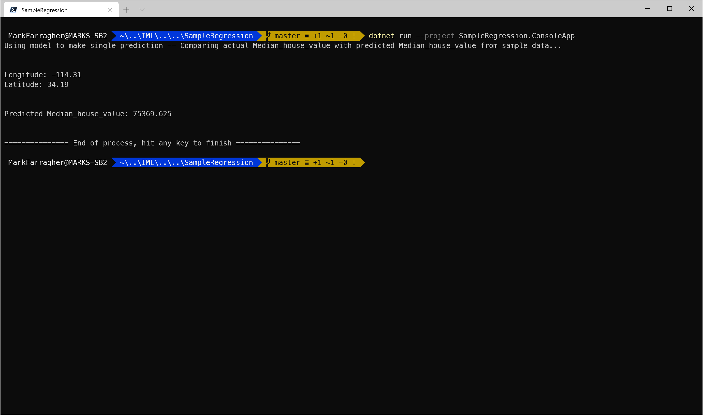
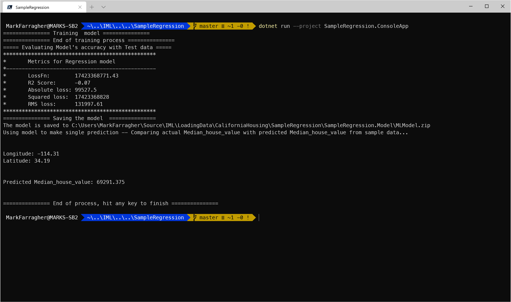

# Assignment: Predict California house prices

In machine learning circles, the **California Housing dataset** is a bit of a classic. It's the dataset used in the second chapter of Aurélien Géron's excellent machine learning book 'Hands-On Machine learning with Scikit-Learn and TensorFlow'. 

The dataset serves as an excellent introduction to building  machine learning apps because it requires rudimentary data cleaning, has an easily understandable list of variables and has the perfect size for fast training and experimentation.

The dataset was compiled by Pace, R. Kelley and Ronald Barry for their 1997 paper titled 'Sparse Spatial Autoregressions'. They built it using the 1990 California census data. 

It contains one record per census block group, with a census block group being the smallest geographical unit for which the U.S. Census Bureau publishes sample data. A census block group typically has a population of around 600 to 3,000 people.

In this assignment you're going to use the California Housing dataset to build a model that can predict the prices of houses in California.

## Get the dataset

Let's start by downloading the dataset. Grab the [training data](#) and [testing data](#) files and save them on your computer as **california_housing_train.csv** and **california_housing_test.csv**. 

Both files combine into a 17,000-record dataset that looks like this:



Here's a description of each column:

* Column 1: The longitude of the housing block
* Column 2: The latitude of the housing block
* Column 3: The median age of all the houses in the block
* Column 4: The total number of rooms in all houses in the block
* Column 5: The total number of bedrooms in all houses in the block
* Column 6: The total number of people living in all houses in the block
* Column 7: The total number of households in all houses in the block
* Column 8: The median income of all people living in all houses in the block
* Column 9: The median house value for all houses in the block

We can use this data to train a model  to predict the price of any house in and outside the state of California. 

Let's do that now. 

Please open a console window. You are going to create a folder to hold all the files of this assignment:

```bash
$ mkdir CaliforniaHousing
$ cd CaliforniaHousing
```

Also make sure to copy the two dataset files into this folder. 

## Train the model

Now you're ready to start training a machine learning model. To keep things simple we're only going to look at the latitude and longitude columns for now and ignore everything else in the dataset. 

Type the following command in your console window:

```bash
$ mlnet regression --dataset .\california_housing_train.csv --test-dataset .\california_housing_test.csv --label-col median_house_value --ignore-cols housing_median_age total_rooms total_bedrooms population households median_income
```

**mlnet** is the Microsoft ML.NET CLI tool. It's a command-line tool that can train machine learning models from CSV datafiles directly and produce all the C# code we need to train a model and then consume that fully-trained model.

Let's take a closer look at the command-line arguments:

* **--dataset**: the dataset to use for training the machine learning model. This can be a comma-separated or tab-separated text file.
* **--validation-dataset**: the dataset to use to validate the performance of the fully-trained machine learning model. 
* **--label-col**: the column in the dataset that contains the label we're trying to predict.
* **--ignore-cols**: an optional list of columns in the dataset to ignore.

So what we're doing here is trying to predict the **median_house_value** column. We're ignoring every other column in the dataset except **latitude** and **longitude**. 

Here's what the running app looks like in my Windows Terminal:


The tool has loaded the training and testing datasets and is now randomly trying out machine learning algorithms and algorithm parameters to create the best possible median house value predictions.

You can see that at the point of the screenshot, the tool has already tried out 25 different machine learning algorithms, these are listed in the **Training** column. 

You'll notice that the same algorithm appears multiple times. This is because the tool keeps trying to tweak the configuration parameters of each algorithm to improve the predictions even further. 

The performance of each algorithm is listed in the **RSquared**, **Absolute-loss**, **Squared-loss** and **RMS-loss** columns. The tool uses the RSquared value to keep track of the best algorithm to date, which is shown in the final line of text. 

In the screenshot, the best algorithm is LbfgsPoissonRegression which achieved an RSquared value of 0.2079 (bigger is better). This happened in experiment 22. 

The tool continues to try out algorithms until a set time period has expired. By default this is 100 seconds, at which the tool selects the winning algorithm.

Here's what that looks like on my computer:


After 33 experiments, the tool has selected FastTreeRegression as the winning algorithm. It achieved a winning RSquared value of 0.7658.

The top-5 list of winning algorithms shows multiple variations of the FastTreeRegression and LightGbmRegression algorithms with slightly differing configuration settings. 

And finally, the tool reports that it has created a C# app for us that can either train this model from scratch, or use a pre-trained model to predict the price of any house. The project files have been placed in the **SampleRegression** folder.

## Inspect the C# code

Let's take a look at all the files the CLI tool has created. Run the following Powershell command on the console:

```bash
$ l -recurse -file -depth 1 sampleregression
```

You'll see the following output:


There are three folders:

* **SampleRegression**: The solution folder for the generated app containing a single SLN file for Visual Studio.
* **SampleRegression/SampleRegression.ConsoleApp**: A console project that consumes the fully-trained model to make a prediction. There's also a **ModelBuilder.cs** file which can train the model from scratch.
* **SampleRegression/SampleRegression.Model**: A library project with helper classes for training and consuming the model. There's also a ZIP file with a saved copy of the fully-trained model which can be consumed right away without any further training. 

You can use these project files as the basis for your own machine learning application. Out of the box, these files will replicate the best performance you saw when running the ML.NET CLI tool. 

At this point, you have two possible scenarios for building your own app:

* Load the ZIP file with the fully-trained model and start making predictions right away. You'll need to link the **SampleRegression.Model** project into your own solution, and then use the code in **SampleRegression.ConsoleApp/Program.cs** as a starting point to consume the model. 
* Train your own model from scratch. You'll need to link the **SampleRegression.Model** project into your own solution, and then use the code in **SampleRegression.ConsoleApp/ModelBuilder.cs** as a starting point to train your model. You'll also need to put the CSV training files in your project directory. 

The first scenario is fine if your training data is static and not expected to change. Just load the ZIP file with the pretrained model and start making predictions right away.

The second scenario is useful if your training data is very dynamic and changes all the time, necessitating constant retraining. Grab the latest data, train your model from scratch and then start making predictions based on the most recent data. 

Just keep in mind that training the model may take a while (anything from a few seconds to many minutes) and the user will need to wait until the training process has completed.

### The SampleRegression.ConsoleApp project

Now let's take a closer look at the generated code. Go to the SampleRegression folder and open Visual Studio code:

```bash
$ cd SampleRegression
$ code .
```

In Visual Studio Code, select the **SampleRegression.ConsoleApp/Program.cs** file. You'll see something like this:


The Program.cs file contains a very short code snippet for using the fully-trained model to make a prediction. 

The Main method starts like this:

```csharp
// Create single instance of sample data from first line of dataset for model input
ModelInput sampleData = new ModelInput()
{
    Longitude = -114.31F,
    Latitude = 34.19F,
};
}
```

We can use the **ModelInput** class to feed data into the model and ask it to make a prediction. We'll see in a minute how this class is defined. 

Remember back when we ran the ML.NET CLI tool that we ignored all data columns except the longitude and latitude? That's why the ModelInput class only uses the **Longitude** and **Latitude** fields. We cannot provide any other information because the model hasn't been trained on those fields and will ignore them. 

The next line uses the model to make a prediction:

```csharp
// Make a single prediction on the sample data and print results
var predictionResult = ConsumeModel.Predict(sampleData);
}
```

The **ConsumeModel** class has a public **Predict** method. We provide a **ModelInput** instance and get a prediction in return. 

Just like ModelInput, the ConsumeModel class is defined in the other project. We'll get to that in a minute. 

Now that we have a prediction, we can display it like this:

```csharp
Console.WriteLine("Using model to make single prediction -- Comparing actual Median_house_value with predicted Median_house_value from sample data...\n\n");
Console.WriteLine($"Longitude: {sampleData.Longitude}");
Console.WriteLine($"Latitude: {sampleData.Latitude}");
Console.WriteLine($"\n\nPredicted Median_house_value: {predictionResult.Score}\n\n");
```

The prediction has a field called **Score** which contains the predicted median_house_value. 

Before we look at the other classes, let's quickly run this app to make sure everything works. 

Type the following on the console:

```bash
$ dotnet run --project SampleRegression.ConsoleApp
```

This will run the app and show the following:



Given a house location of -114.31 degrees longitude and 34.19 degrees latitude, the model predicts a median house value of $75,369 for that block.

That's pretty cheap, but keep in mind that this location is literally in the middle of nowere, several hundreds of kilometers south of Salt Lake City.  

### The SampleRegression.Model project

Okay, now let's look at those helper classes. Select the **SampleRegression.Model/ModelInput.cs** file in Visual Studio Code. You'll see that it looks like this:

```csharp
public class ModelInput
{
    [ColumnName("longitude"), LoadColumn(0)]
    public float Longitude { get; set; }

    [ColumnName("latitude"), LoadColumn(1)]
    public float Latitude { get; set; }

    [ColumnName("housing_median_age"), LoadColumn(2)]
    public float Housing_median_age { get; set; }

    [ColumnName("total_rooms"), LoadColumn(3)]
    public float Total_rooms { get; set; }

    [ColumnName("total_bedrooms"), LoadColumn(4)]
    public float Total_bedrooms { get; set; }

    [ColumnName("population"), LoadColumn(5)]
    public float Population { get; set; }

    [ColumnName("households"), LoadColumn(6)]
    public float Households { get; set; }

    [ColumnName("median_income"), LoadColumn(7)]
    public float Median_income { get; set; }

    [ColumnName("median_house_value"), LoadColumn(8)]
    public float Median_house_value { get; set; }
}
```

It's just a simple data class with properties for every column in the dataset. And note the **LoadColumn** attributes that defines from which CSV data column the property should be loaded. Longitude is loaded from the first column, Latitude from the second, and so on. 

Also note how each property is a **float**. By default, ML.NET loads and processes all numeric data as 4-byte floating point numbers. 

You'll notice that there's also a **ModelOutput.cs** file. It looks like this:

```csharp
public class ModelOutput
{
    public float Score { get; set; }
}
```

This is again a simple data class with a single property called **Score** which contains the median house value predicted by the model.

And finally, let's look at the **ConsumeModel.cs** file which contains all the code for consuming the pretrained model and making predictions.

The class starts like this:

```csharp
private static Lazy<PredictionEngine<ModelInput, ModelOutput>> PredictionEngine = new Lazy<PredictionEngine<ModelInput, ModelOutput>>(CreatePredictionEngine);
```

This sets up a static field called **PredictionEngine**. It uses the **Lazy** class to set up lazy evaluation, meaning the field will be lazily initialized on first access. The field initialization will be handled by a method called **CreatePredictionEngine** which we'll get to in a moment.

The prediction engine is responsible for making predictions, so now that we have the field set up, we can define the **Predict** method like this:

```csharp
// For more info on consuming ML.NET models, visit https://aka.ms/mlnet-consume
// Method for consuming model in your app
public static ModelOutput Predict(ModelInput input)
{
    ModelOutput result = PredictionEngine.Value.Predict(input);
    return result;
}
```

Predict takes a **ModelInput**, makes a prediction, and then returns it as a **ModelOutput**.

The call to **PredictionEngine.Value** triggers lazy evaluation and instantiates an ML.NET prediction engine. We can then call its **Predict** method to feed the input data to the machine learning model and obtain the prediction.

So all that remains is to look at the **CreatePredictionEngine** method. How do you create prediction engines in ML.NET? 

It's actually super-simple. Here's the entire method:

```csharp
public static PredictionEngine<ModelInput, ModelOutput> CreatePredictionEngine()
{
    // Create new MLContext
    MLContext mlContext = new MLContext();

    // Load model & create prediction engine
    string modelPath = @"C:\Users\MarkFarragher\Source\IML\LoadingData\CaliforniaHousing\SampleRegression\SampleRegression.Model\MLModel.zip";
    ITransformer mlModel = mlContext.Model.Load(modelPath, out var modelInputSchema);
    var predEngine = mlContext.Model.CreatePredictionEngine<ModelInput, ModelOutput>(mlModel);

    return predEngine;
}
```

The code starts by setting up a new ML.NET machine learning context using the **MLContext** class. 

Then it calls the **Model.Load** method to load the ZIP file with the pretrained model into memory.

Finally, the code calls **Model.CreatePredictionEngine** to set up a prediction engine. Note the two type parameters which specify the input and output data types. 

And that's it. That's all the code you need to consume a fully-trained model and use it to make your own predictions. 

### The ModelBuilder class

Finally, let's take a look at the **ModelBuilder** class in the ConsoleApp project that can train the model from scratch.

Select the **SampleRegression.ConsoleApp/ModelBuilder.cs** file in Visual Studio Code. 

You'll see that the class starts like this:

```csharp
public static class ModelBuilder
{
       private static string TRAIN_DATA_FILEPATH = @"C:\Users\MarkFarragher\Source\IML\LoadingData\CaliforniaHousing\california_housing_train.csv";
        private static string TEST_DATA_FILEPATH = @"C:\Users\MarkFarragher\Source\IML\LoadingData\CaliforniaHousing\california_housing_test.csv";
        private static string MODEL_FILEPATH = @"C:\Users\MarkFarragher\Source\IML\LoadingData\CaliforniaHousing\SampleRegression\SampleRegression.Model\MLModel.zip";
        // Create MLContext to be shared across the model creation workflow objects 
        // Set a random seed for repeatable/deterministic results across multiple trainings.
        private static MLContext mlContext = new MLContext(seed: 1);

    // ...
}
```

There are two path constants for the training and testing data files, and a third path constant specifying where the trained model ZIP file should be saved.

The **seed** argument initializes the random number generator of the machine learning context to a discrete value. This will produce repeatable results accross multiple training runs. Usually this is what you want, but feel free to remove the seed if you want randomized model initialization.

Next up is a method called **CreateModel** which performs a complete end-to-end training run:

```csharp
public static void CreateModel()
{
    // Load Data
    IDataView trainingDataView = mlContext.Data.LoadFromTextFile<ModelInput>(
                                    path: TRAIN_DATA_FILEPATH,
                                    hasHeader: true,
                                    separatorChar: ',',
                                    allowQuoting: true,
                                    allowSparse: false);

    IDataView testDataView = mlContext.Data.LoadFromTextFile<ModelInput>(
                                    path: TEST_DATA_FILEPATH,
                                    hasHeader: true,
                                    separatorChar: ',',
                                    allowQuoting: true,
                                    allowSparse: false);

    // Build training pipeline
    IEstimator<ITransformer> trainingPipeline = BuildTrainingPipeline(mlContext);

    // Train Model
    ITransformer mlModel = TrainModel(mlContext, trainingDataView, trainingPipeline);

    // Evaluate quality of Model
    EvaluateModel(mlContext, mlModel, testDataView);

    // Save model
    SaveModel(mlContext, mlModel, MODEL_FILEPATH, trainingDataView.Schema);
}
```

The method starts by calling **Data.LoadFromTextFile** twice to load the training and testing data files in memory.

It then calls **BuildTrainingPipeline** to build an ML.NET machine learning pipeline, **TrainModel** to train the model, **EvaluateModel** to evaluate the trained model on the test data, and **SaveModel** to save the model to disk as a ZIP file.

Let's look at these four methods one by one. We'll start with **BuildTrainingPipeline**:

```csharp
public static IEstimator<ITransformer> BuildTrainingPipeline(MLContext mlContext)
{
    // Data process configuration with pipeline data transformations 
    var dataProcessPipeline = mlContext.Transforms.Concatenate("Features", new[] { "longitude", "latitude" });
    // Set the training algorithm 
    var trainer = mlContext.Regression.Trainers.FastTree(new FastTreeRegressionTrainer.Options() { NumberOfLeaves = 52, MinimumExampleCountPerLeaf = 10, NumberOfTrees = 100, LearningRate = 0.07795183f, Shrinkage = 3.2820036f, LabelColumnName = "median_house_value", FeatureColumnName = "Features" });

    var trainingPipeline = dataProcessPipeline.Append(trainer);

    return trainingPipeline;
}
```

Machine learning models in ML.NET are built with pipelines, which are sequences of data-loading, transformation, and learning components.

This pipeline has the following components:

* A **Concatenate** component which combines all input data columns into a single column called 'Features'. This is a required step because ML.NET can only train on a single input column.
* A **FastTree** regression training algorithm which will use a 'decision tree' training algorithm to train the model. 

The NumberOfLeaves, MinimumExampleCountPerLeaf, NumberOfTrees, LearningRate and Shrinkage arguments are called **hyperparameters**. They control the learning process of the machine learning model. These specific  parameter values were discovered by the ML.NET CLI tool during the training process.

Now that we have a fully-assembled training pipeline, we can use it to train the model:

```csharp
public static ITransformer TrainModel(MLContext mlContext, IDataView trainingDataView, IEstimator<ITransformer> trainingPipeline)
{
    Console.WriteLine("=============== Training  model ===============");

    ITransformer model = trainingPipeline.Fit(trainingDataView);

    Console.WriteLine("=============== End of training process ===============");
    return model;
}
```

You can see that training is very easy. Just call the **Fit** method on the assembled machine learning pipeline and provide the training data. The return value is a fully-trained machine learning model.

Now that we have a trained model, we can do a quick check to see how well it performs. We'll create predictions for every house in the test dataset, compare these predictions with the actual median house values, and calculate the **RSquared**, **Absolute-loss**, **Squared-loss** and **RMS-loss** values:

```csharp
private static void EvaluateModel(MLContext mlContext, ITransformer mlModel, IDataView testDataView)
{
    // Evaluate the model and show accuracy stats
    Console.WriteLine("===== Evaluating Model's accuracy with Test data =====");
    IDataView predictions = mlModel.Transform(testDataView);
    var metrics = mlContext.Regression.Evaluate(predictions, "median_house_value", "Score");
    PrintRegressionMetrics(metrics);
}
```

This method calls **Transform** to create predictions for every housing block in the test dataset, and **Evaluate** to compare these predictions with the actual median house values. 

The return value is a **metrics** object with performance metrics that describe the quality of the predictions. 

The **PrintRegressionMetrics** method displays these performance metrics:

```csharp
public static void PrintRegressionMetrics(RegressionMetrics metrics)
{
    Console.WriteLine($"*************************************************");
    Console.WriteLine($"*       Metrics for Regression model      ");
    Console.WriteLine($"*------------------------------------------------");
    Console.WriteLine($"*       LossFn:        {metrics.LossFunction:0.##}");
    Console.WriteLine($"*       R2 Score:      {metrics.RSquared:0.##}");
    Console.WriteLine($"*       Absolute loss: {metrics.MeanAbsoluteError:#.##}");
    Console.WriteLine($"*       Squared loss:  {metrics.MeanSquaredError:#.##}");
    Console.WriteLine($"*       RMS loss:      {metrics.RootMeanSquaredError:#.##}");
    Console.WriteLine($"*************************************************");
}
```

This method displays the RSquared score, the absolute loss, the squared loss and the RMS loss, just like the ML.NET CLI tool did during training. 

And finally, we can save the trained model to disk:

```csharp
private static void SaveModel(MLContext mlContext, ITransformer mlModel, string modelRelativePath, DataViewSchema modelInputSchema)
{
    // Save/persist the trained model to a .ZIP file
    Console.WriteLine($"=============== Saving the model  ===============");
    mlContext.Model.Save(mlModel, modelInputSchema, GetAbsolutePath(modelRelativePath));
    Console.WriteLine("The model is saved to {0}", GetAbsolutePath(modelRelativePath));
}
```

This code calls **Model.Save** to save the fully trained model to disk as a ZIP file. 

And that's it. That's all the code you need to train a machine learning model from scatch on training and testing datasets.

Let's take this code for a spin. 

We're going to have to make a small tweak to the ConsoleApp project. Out of the box it only makes a single test prediction, we're going to modify the code to train the machine learning model from scratch first. 

Select the **SampleRegression.ConsoleApp/Program.cs** file in Visual Studio Code, and add the following code to the top of the Main method, before any other code:

```csharp
// train the model from scratch
ModelBuilder.CreateModel();
```

Now execute the following command on the console:

```bash
$ dotnet run --project SampleRegression.ConsoleApp
```

This will run the app and show the following:



Note the new output at the top. The model gets trained from scratch, evaluated, and then saved to a ZIP file. And then the model is consumed to make the single prediction.

The RSquared is now -0.07 and the RMS loss is 131,997. And we get a new price prediction for our house in the middle of nowhere of $69,291. This is about $6k lower than our previous prediction. 

Getting slightly different results after retraining is perfectly normal in machine learning. Model training is a process of iterative discovery and quite often retraining uncovers a new optimum that's slightly better or slightly worse than what we had previously.  

## Observations

Did you notice that the generated code does not contain any input feature processing?

We are working with longitude and latitude data, so we're supposed to bin, one-hot encode, and cross them to create a grid covering the state of California. 

But the code generated by the ML.NET CLI tool doesn't do any of that. It just reads the data in directly and trains a model on the raw geo data.

This goes to show that the tool is not perfect. It cannot magically produce the best possible machine learning application for your data files. 

The tool is very good at finding the best possible learning algorithm for your datasets and configure the hyperparameters in an optimal way, but it struggles at discovering how to find the best possible way to preprocess the columns in your datasets. 

You will always have to do some manual code-tweaking and experimentation to improve your results and find the best possible machine learning model. 

So how could we process the input features to improve the model? 

Well, we could:

* Divide the **median_house_value** column by 1,000 (scaling) to bring its range in line with the other columns.
* Bin, one-hot encode and cross the **latitude** and **longitude** columns.
* Analyze the **total_rooms**, **total_bedrooms** and **population** columns and remove any outliers.

Are there any other processing steps you can think of? 

Writing C# code to process features is outside the scope of this introductionary training. But I would invite you to take a look at my [Machine Learning with C# and ML.NET course](https://www.machinelearningadvantage.com/datascience-with-csharp) where we take a deep dive into feature processing. 

## Improve the model

Remember when we ran the ML.NET CLI tool and told it to ignore all columns except latitude and longitude? 

That was a bit extreme, because we're forcing the model to produce accurate house price predictions by looking only at the location of the house. 

You can imagine that the other features of the house (number of occupants, number of rooms, average income of the occupants) will also help a lot in determining the house value. 

So lets to another run and use all the columns in the datafile. 

I invite you to run the CLI tool again but this time without the **--ignore-cols** argument so the model gets trained on all available columns.  

Which RSquared and RMS-loss values do you get now? And which learning algorithm has the CLI tool selected? 

Feel free to try different combinations of columns to find the best possible result. 

## Homework

Once you've found your best-performing model, please report your results online to get entered into our hall of fame.


Click the following link to access the online submission form on your PC or mobile: 

[https://forms.office.com/Pages/ResponsePage.aspx....](https://forms.office.com/Pages/ResponsePage.aspx?id=cDwqJ-Givk-T_qyHkmGIbU3xYGpQDIZMlmak2FZVNMJUOUdYUkU5SFgwNjVZUEE2NFFKMlJMMEVLSi4u)

And then in the form please report the following:

* Your first name or online handle
* The dataset you're using (= **California Housing**)
* The columns you used in your best model
* The learning algorithm you used in your best model
* The metric you used to evaluate your model (= **RMSE**)
* The RMS-loss value of your best model

I will periodically compile all submissions into a top-10 hall of fame and share the list in my courses and on social media. 

You'll be famous!

And feel free to brag about your results in our Slack group ;) 

Good luck!
